## Submissions from Craftsmen!
All current pending Workshop Users have now submitted their Tools / Equipment they are donating to the Workshop for us to make our selections from.  Those pending Workshop Users not shown below are O.K. for us to choose from those Tools / Equipment submitted by others.  ...  We've reviewed the Tools / Equipment submitted and recommend (based upon age, mechanical condition, new parts, features, functions, and individual factors) those highlighted with a green checkmark ✅ in the descriptions below.  
*(Click a Pictiure for a High Definition Version!)* 

####  Len-B's Submissions.
<table>
  <tr>
    <th>Drill Press</td>
    <th>Planer</td>
  </tr>
  <tr>
      <td valign="top">
      <a href="../CraftsMen/Len-B/drill-press.jpeg">
      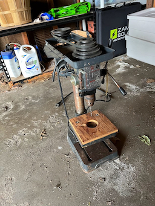
      </a>
      </td>
      <td valign="top">
      <a href="../CraftsMen/Len-B/planer.jpeg">
      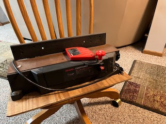
      </a>
      </td>
  </tr>
 </table>

<table>
  <tr>
    <th>Router-Jigsaw</td>
	<th>:white_check_mark:  Scrollsaw
</td>
  </tr>
  <tr>
      <td valign="top">
       <a href="../CraftsMen/Len-B/router-jigsaw.jpeg">
      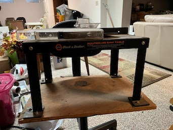
      </a>
      </td>
      <td valign="top">
      <a href="../CraftsMen/Len-Bscrollsaw.jpeg">
      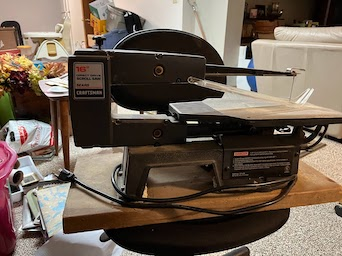
      </a>
      </td>
  </tr>
 </table>
 
* * *

####  Len-C's Submissions.

<table>
  <tr>
    <th>Delta Band Saw</td>
    <th>Bench Drawers</td>
    <th> Drill Press</td>
  </tr>
  <tr>
      <td valign="top">
      <a href="../CraftsMen/Len-C/Band-Saw.jpeg">
      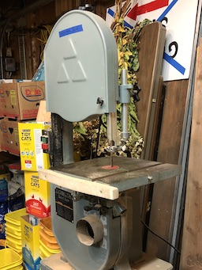
      </a>
      </td>
      <td valign="top">
      <a href="../CraftsMen/Len-C/Bench-Drawers.jpeg">
      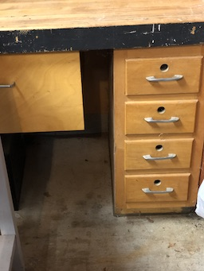
      </a>
      </td>
      <td valign="top">
       <a href="../CraftsMen/Len-C/Drill-Press.jpeg">
      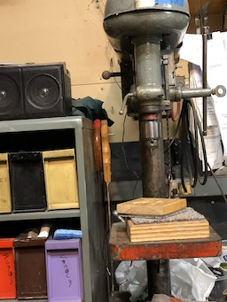
      </a>
      </td>
  </tr>
 </table>
 
 <table>
   <tr>
     <th>Sorted-Fasteners</td>
     <th>:white_check_mark:  Table-Saw</td>
   </tr>
   <tr>
       <td valign="top">
       <a href="../CraftsMen/Len-C/Sorted-Fasteners.jpeg">
       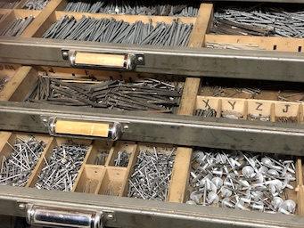
       </a>
       </td>
       <td valign="top">
        <a href="../CraftsMen/Len-C/Table-Saw.jpeg">
       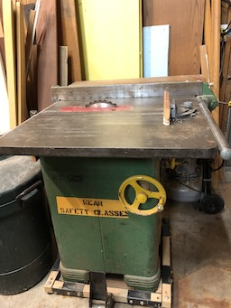
       </a>
       </td>
   </tr>
  </table>
  
 <table>
   <tr>
     <th>:white_check_mark:  WorkBench</td>
   </tr>
   <tr>
       <td valign="top">
       <a href="../CraftsMen/Len-C/Workbench.jpeg">
       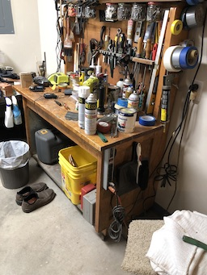
       </a>
       </td>
 <td valign="top">
       <a href="../CraftsMen/Len-C/Sanding-Table.jpeg">
       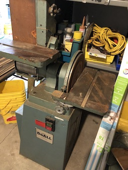
       </a>
       </td>
       </tr>
  </table>
 
* * *

#### Jim-E's Submissions.
<table>
  <tr>
    <th>:white_check_mark:  A steel shelf.</td>
    <th>A workbench.</td>
  </tr>
  <tr>
      <td valign="top">
      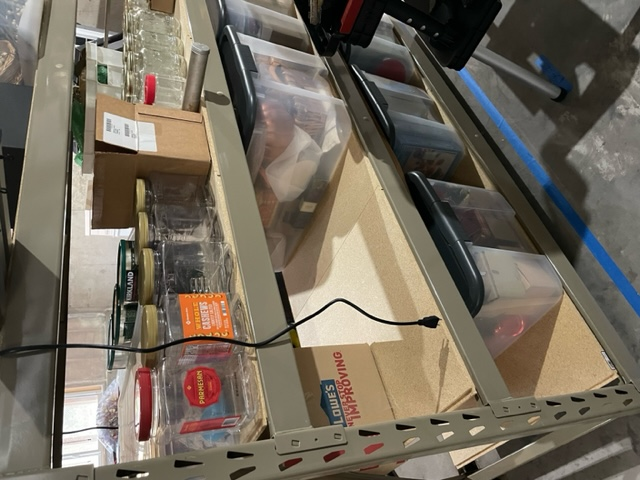
      </a>
      </td>
      <td valign="top">
      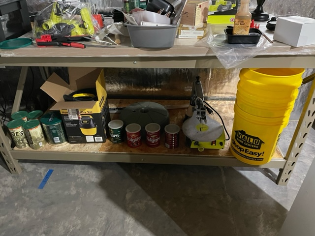
      </a>
      </td>
  </tr>
 </table>
<table>
  <tr>
    <th>A couple more workbenches.</td>
    <th>:white_check_mark:   Nice tool chest.</td>   
  </tr>
  <tr>
      <td valign="top">
      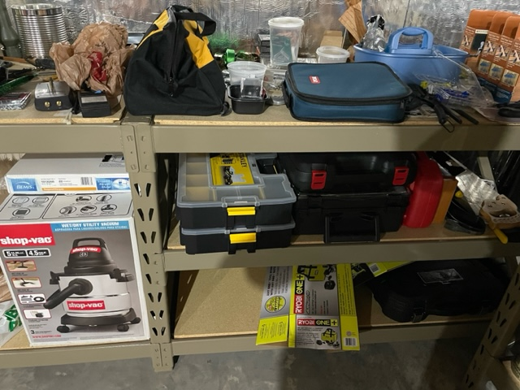
      </a>
      </td>
        <td valign="top">
      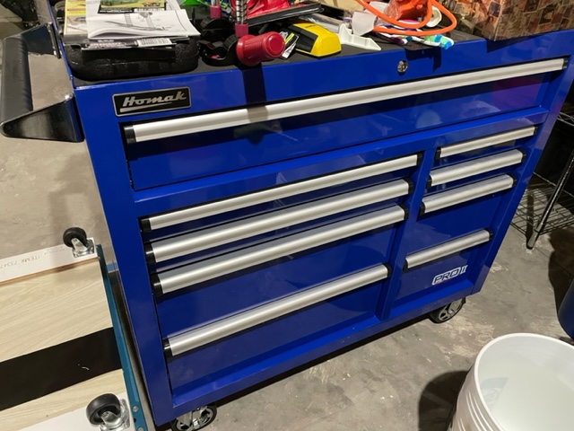
      </a>
      </td>
  </tr>
 </table>

- :white_check_mark:   Jim has a large assortment of Bessel Clamps and some nice Ryobi handheld tools!

***

#### Mark-G's Submissions.
 
<table>
  <tr>
    <th>:white_check_mark:  Two Husky Tool Chests  (Tools Inside!) </td>
  </tr>
  <tr>
      <td valign="top">
      <a href="../CraftsMen/Mark-G/Tool-Boxes.jpeg">
      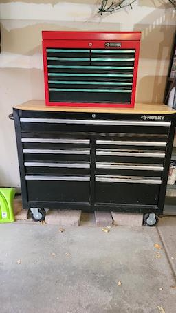
      </a>
      </td>
</table>

***

#### Linelle-J's Submissions.
<table>
  <tr>
    <th>Band-Saw</td>
    <th>:white_check_mark: Belt-Sander</td>
    <th>:white_check_mark: Drill-Press</td>
  </tr>
  <tr>
      <td valign="top">
      <a href="../CraftsMen/Linelle-J/Band-Saw.jpg">
      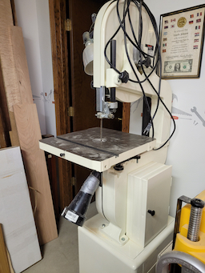
      </a>
      </td>
      <td valign="top">
      <a href="../CraftsMen/Linelle-J/Belt-Sander.jpg">
      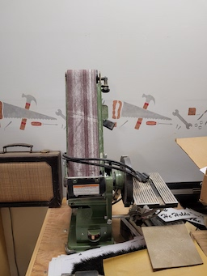
      </a>
      </td>
      <td valign="top">
      <a href="../CraftsMen/Linelle-J/Drill-Press.jpg">
      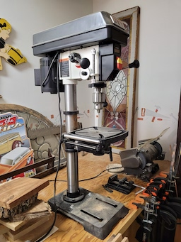
      </a>
      </td>
  </tr>
 </table>

<table>
  <tr>
    <th>:white_check_mark: Dust-Collector</td>
    <th>Table-Saw</td>
    <th>:white_check_mark: Miter-Saw</td>
  </tr>
  <tr>
      <td valign="top">
      <a href="../CraftsMen/Linelle-J/Dust-Collector.jpg">
      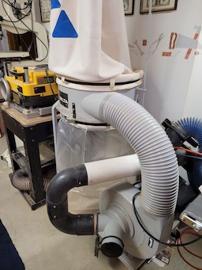
      </a>
      </td>      
      <td valign="top">
      <a href="../CraftsMen/Linelle-J/Table-Saw.jpg">
      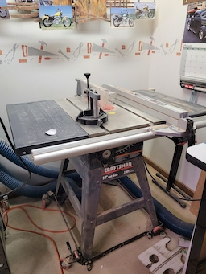
      </a>
      </td>
      <td valign="top">
      <a href="../CraftsMen/Linelle-J/Miter-Saw.jpg">
      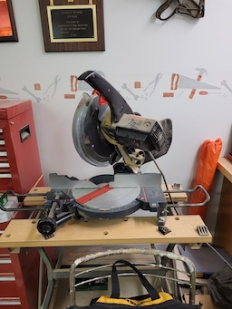
      </a>
      </td>
  </tr>
 </table>

 <table>
  <tr>
    <th>:white_check_mark: A Nice Planar</td>
    <th>:white_check_mark: Planer</td>
    <th>:white_check_mark: Router-Table</td>
  </tr>
  <tr>
      <td valign="top">
      
      </td>
      <td valign="top">
      <a href="../CraftsMen/Linelle-J/Planer-2.jpg">
      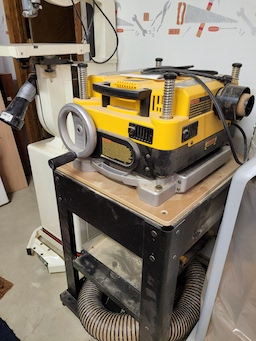
      </a>
      </td>
      <td valign="top">
      <a href="../CraftsMen/Linelle-J/Router-Table.jpg">
      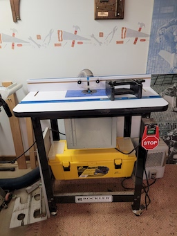
      </a>
      </td>
  </tr>
 </table>
  <table>
  <tr>
    <th>:white_check_mark: 1" Belt-Sander</td>
    <th>:white_check_mark: Scroll Saw</td>
    <th>:white_check_mark: Lathe </td>
  </tr>
  <tr>
      <td valign="top">
      <a href="../CraftsMen/Linelle-J/One-Inch-Belt-Sander.jpg">
      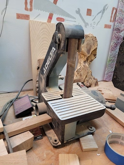
      </a>
      </td>
      <td valign="top">
      <a href="../CraftsMen/Linelle-J/Scroll-Saw.jpg">
      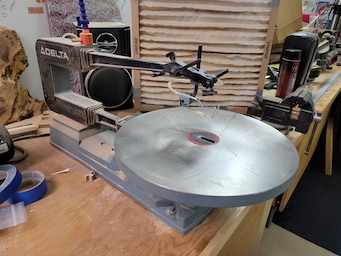
      </a>
      </td>
            <td valign="top">
      <a href="../CraftsMen/Linelle-J/Lathe.jpeg">
      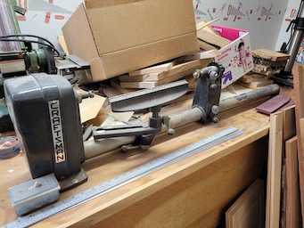
      </a>
      </td>
  </tr>
 </table>
-  Linelle recently added a few more items to his list.  
   -  36 x 12 Inch Lalthe (Above)
   -  :white_check_mark: Inch Drum Sander (Unpictured)
   -  Scroll Saw (Above)

***

#### Ralph-L's Submissions.

<table>
  <tr>
    <th>Rigid Work Support</td>
    <th>:white_check_mark:  Machine Table on Drill Press</td>
    <th>10" Compound Miter</td>
    <th>:white_check_mark:  10" Ryobi Table Saw</td>   
  </tr>
  <tr>
      <td valign="top">
      <a href="../CraftsMen/Ralph-L/image1.jpeg">
      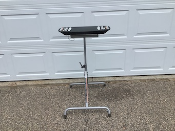
      </a>
      </td>
      </td>
      <td valign="top">
      <a href="../CraftsMen/Ralph-L/image11.jpeg">
      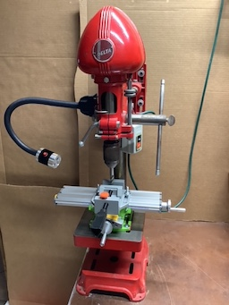
      </a>
      </td>
        <td valign="top">
      <a href="../CraftsMen/Ralph-L/image3.jpeg">
      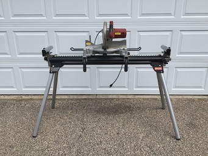
      </a>
      </td>
        <td valign="top">
      <a href="../CraftsMen/Ralph-L/image4.jpeg">
      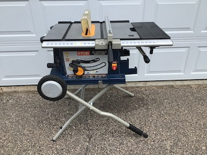
      </a>
      </td>
  </tr>
 </table>
 
- Click thumbnails for Hi Def Pictures)

  ##### Some other tools...
- 7 1/4" Circular Saw (Rockwell)
- 4.5 Amp Variable Speed Jigsaw (Black & Decker)
- Cordless Powered Hand Saw (Black & Decker)
- Airgrip Multitaskit Lazer Level (Ryobi)
- 18v 1/2" Cordless Drill/Driver (Master Force)
- 6v 1/2" Cordless Drill (Black & Decker)
- Orbital Sander (Rockwell)
- Woodworking Hand Tools
- 6 Gallon Wet/Dry Shop Vacuum (Genie Jet Vac)
- St. Paul Technical College Cabinetmaking Hand Tools & Manuals (my son has Diploma in Cabinetmaking

* * *

#### Gary-L's Submissions.
<table>
  <tr>
    <th>12 Inch Miter Saw</th>
    <th>:white_check_mark:   Grinder</th>
    <th>Orbital Sander</th>
  </tr>
  <tr>
      <td valign="top">
      <a href="../CraftsMen/Gary-L/12-Inch-Miter-Saw.jpeg">
      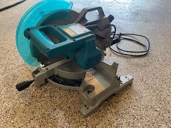
      </a>
      </td>
      <td valign="top">
      <a href="../CraftsMen/Gary-L/Bench-Grinder.jpeg">
      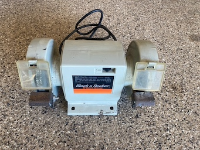
      </a>
      </td>
      <td valign="top">
      <a href="../CraftsMen/Gary-L/Orbital-Sander.jpeg">
      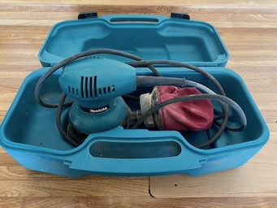
      </a>
      </td>
  </tr>
 </table>

<table>
  <tr>
    <th>Compressor</th>
    <th>Good Brush</th>
    <th>Hand Truck</th>
  </tr>
  <tr>
 <td valign="top">
      <a href="../CraftsMen/Gary-L/Compressor.jpeg">
      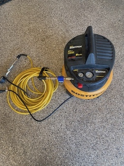
      </a>
      </td>      
      <td valign="top">
      <a href="../CraftsMen/Gary-L/Good-Brush.jpeg">
      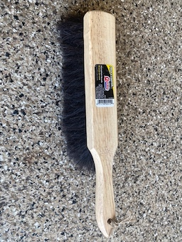
      </a>
      </td>
      <td valign="top">
      <a href="../CraftsMen/Gary-L/Hand-Truck.jpeg">
      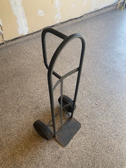
      </a>
      </td>
  </tr>
  </table>

 <table>
  <tr>
    <th>:white_check_mark:  Lapidary Table</th>
    <th>:white_check_mark:  Rock Drill</th>
    <th>:white_check_mark:  Rock Saw</th>
    <th>:white_check_mark:  Shop Vacuum</th>		
  </tr>
  <tr>
      <td valign="top">
      <a href="../CraftsMen/Gary-L/Lapidary-Table.jpeg">
      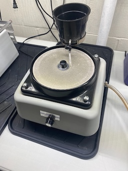
      </a>
      </td>
      <td valign="top">
      <a href="../CraftsMen/Gary-L/Rock-Drill.jpeg">
      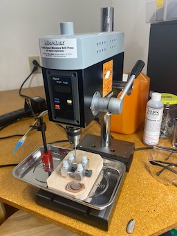
      </a>
      </td>
      <td valign="top">
      <a href="../CraftsMen/Gary-L/Rock-Saw.jpeg">
      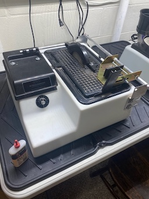
      </a>
      </td>
      <td valign="top">
      <a href="../CraftsMen/Gary-L/Shop-Vac.jpeg">
      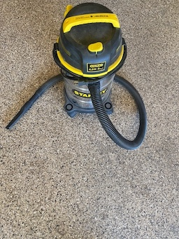
      </a>
      </td>
  </tr>
  </table>

* * *

#### Rick-S
- Rick offered a nice compressor, but we don't have a picture.

***

#### Eric S's Submissions

<table>
  <tr>
    <td>:white_check_mark:   Drill Press</td>
     <td>:white_check_mark:  14" Delta Bandsaw</td>
    <td>:white_check_mark:  Tool Chest</td>
  </tr>
  <tr>
      <td valign="top">
      <a href="../CraftsMen/Eric-S/Drill-Press.jpg">
      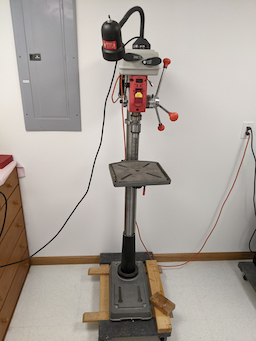
      </a>
      </td>
      <td valign="top">
      <a href="../CraftsMen/Eric-S/Band-Saw.jpg">
      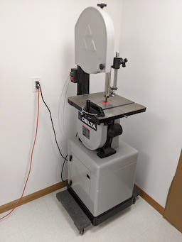
      </a>
      </td>
      <td valign="top">
       <a href="../CraftsMen/Eric-S/Tool-Cabinet-1.jpg">
      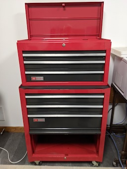
      </a>
      </td>
  </tr>
 </table>
   
 <table>
   <tr>
     <th>Ryobi Belt Sander  With Bench Mount   (Note Square Profile)</td>
     <th>Semi-Portable Table Saw   (Completely Rebuilt)</td>
     <th>:white_check_mark:  Compressor</td>
   </tr>
   <tr>
       <td valign="top">
       <a href="../CraftsMen/Eric-S/Ryobi-Sander.jpg">
       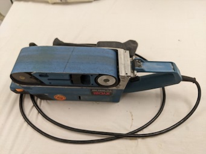
       </a>
       </td>
       </td>
       <td valign="top">
       <a href="../CraftsMen/Eric-S/Collateral/Table-Saw.jpg">
       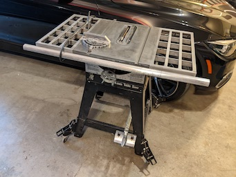
       </a>
       </td>
       <td valign="top">
        <a href="../CraftsMen/Eric-S/Compressor.jpg">
       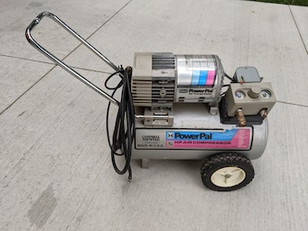
       </a>
       </td>
   </tr>
  </table>
   
  
   #### Some other tools... (Bringing the best stuff or unique - storing in my cage if necessary.)
   
  
- Porter Cable Circular Saw (New)
- Two Metal Tool Cabinets (Drawers)
- Lots of Mechanic's Tools
- :white_check_mark:  A few nice bar clamps (lightweight), and a few nice spring clamps.
- Cheap Square Pad Sander
- Ryobi 18" Belt Sander with Bench Mount
- Like all of us, I have a small collection of handheld power tools, and various hand tools.
- Specialty tools for electronic projects, with some test gear (Meters, power supply, Oscilloscope, etc.)
 

- Also have a Prusa 3DMK3S 3D printer and all the stuff needed to create and print projects.
  - I may keep upstairs.  
  - It would be nice to know if anyone shares this interest.

#### Jack-W's Submissions
<table>
  <tr>
    <th>Dewalt Planer</td>
    <th>:white_check_mark:   Band Saw</td>
    <th>:white_check_mark:    Nice Clamps, etc.</td>
  </tr>
  <tr>
      <td valign="top">
      <a href="../CraftsMen/Jack-W/image0.jpeg">
      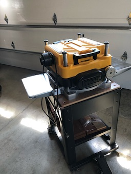
      </a>
      </td>
      <td valign="top">
      <a href="../CraftsMen/Jack-W/image1.jpeg">
      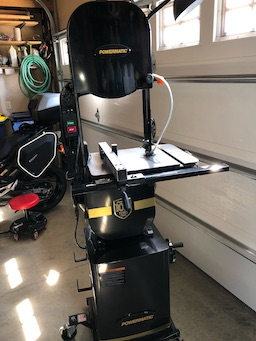
      </a>
      </td>
      <td valign="top">
      <a href="../CraftsMen/Jack-W/image3.jpeg">
      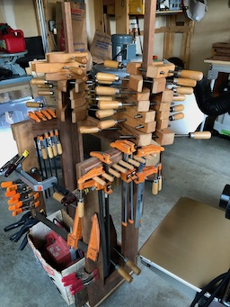
      </a>
      </td>
  </tr>
 </table>

<table>
  <tr>
    <th>Dust Collector</td>
    <th>:white_check_mark:  Rikon Wet Sharpener</td>
    <th>:white_check_mark:  Nice Dust Filer</td>
  </tr>
  <tr>
 <td valign="top">
      
      </td>      
      <td valign="top">
      
      </td>
      <td valign="top">
      
      </td>
  </tr>
 </table>

<table>
  <tr>
    <th>:white_check_mark:  Tool Chest</td>
    <th>:white_check_mark:  Work Bench</td>
    <th>:white_c.heck_mark:  Bench Holes</td>
  </tr>
  <tr>
 <td valign="top">
      
      </td>      
      <td valign="top">
      
      </td>
      <td valign="top">
      
      </td>
  </tr>
 </table>

<table>
  <tr>
    <th>:white_check_mark:  Craftsman Tool Chest</td>
    <th>:white_check_mark:  Lumber for NEW Workbench</td>
    <th>:white_check_mark:  Another Nice Tool Chest.</td>
  </tr>
  <tr>
      <td valign="top">
      
      </td>
      <td valign="top">
      
      </td>
      <td valign="top">
      
      </td>
  </tr>
 </table>

 <table>
  <tr>
    <th>:white_check_mark:  Jack's NEW Custom Workbench
    <th>Other Tools</td>
    <th>(More Tools)</td>
  </tr>
  <tr>
        <td valign="top">
      
      </td>
     	<td valign="top">
	- Milwaukee 4x24 belt sander 
	- Bosch random orbit sander 
	- Makita random orbit sander 
	- Ryobi biscuit joiner 
	- Makita power plane 
      	</td>
      	<td valign="top">
	- Makita water stone power sharpener 
	- Porter Cable detail sander 
	- Porter Cable Brad nailers (2) 
	- Drills and bits. Some Forster, brad point, twist bit, etc 
	- Various other shop items and supplies. 	</td>	
  </tr>
 </table>

* * *

#### Jim-W's Submissions.

<table>
  <tr>
    <th>:white_check_mark:  Air Filter (View 1)</td>
    <th>Dust Collector 1</td>
    <th>Dust Collector 2</td>
  </tr>
  <tr>
      <td valign="top">
      
      </td>
      <td valign="top">
      
      </td>
      <td valign="top">
      
      </td>
  </tr>
 </table>

<table>
  <tr>
    <th>:white_check_mark:  Air Filter (View 2)</td>
    <th>Miter</td>
    <th>:white_check_mark:  Oscillating Sander</td>
  </tr>
  <tr>
 <td valign="top">
      
      </td>      
      <td valign="top">
      
      </td>
      <td valign="top">
      
      </td>
  </tr>
 </table>

 <table>
  <tr>
    <th>Router Table</td>
    <th>Planer</td>
    <th>:white_check_mark:  Radial Arm Saw</td>
  </tr>
  <tr>
      <td valign="top">
      
      </td>
      <td valign="top">
      
      </td>
      <td valign="top">
      
      </td>
  </tr>
 </table>
 
  <table>
  <tr>
    <th>Grizzley Bandsaw</td>
    <th>Jointer</td>
    <th>:white_check_mark:  HVLP Spray Outfit</td>
  </tr>
  <tr>
      <td valign="top">
      
      </td>
      <td valign="top">
      
      </td>
      <td valign="top">
      
      </td>
  </tr>
 </table>

 <table>
  <tr>
    <th>:white_check_mark:  Workbench</td>
    <th>:white_check_mark:  Workbench</td>
  </tr>
  <tr>
      <td valign="top">
      
      </td>
      <td valign="top">
      
  </tr>
 </table>
 
##### Jim has a nice Biscuit Joiner and a Dovetail Jig
##### Jim also has a large collection of power hand tools! 
 
***
