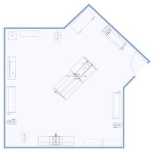
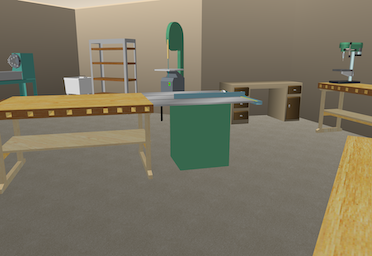
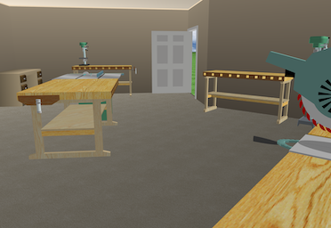
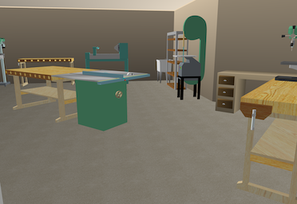
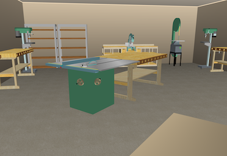

### Models, Renders, and Plans.
-  This page showcases varioius plans, and previews.
   -  We can get an idea how big things are compared to the blueprinted space.
      -  Items shown so far are stand-ins for similar tools since John-B only had some samples.  
<table>
  <tr>
    <th>Overview Scale View of Shop with scaled tool and bench footprints</th>
     <th>From the Back Corner</th>
      <th>From the Other Cornerr</th> 
  </tr>
  <tr>
      <td valign="top">
      
      </td>
      <td valign="top">
      
      </td>
      <td valign="top">
      
      </td>    
  </tr>
 </table>
<table>
  <tr>
     <th>From the Door</th>
      <th>From the Desk</th>    
  </tr>
  <tr>
 <td valign="top">
      
      </td>
      <td valign="top">
      
      </td>    
  </tr>
 </table>
