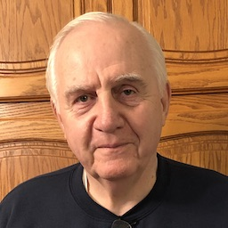
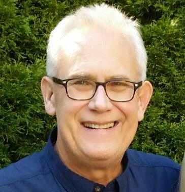
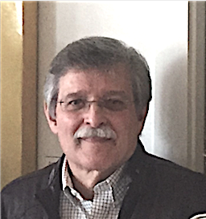
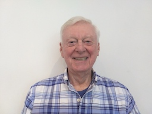
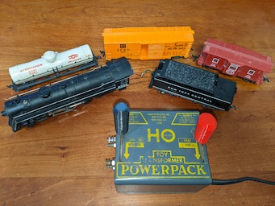
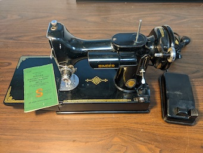
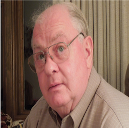

####  Len-C's Profile
<table>
  <tr>
    <th>Len-C</td>
  </tr>
  <tr>
      <td valign="top">
      
      </td
  <tr>
 </table>
 
 -  Staring in 1971, taught Industrial Tech classes in Welding, Woodworking and Small Engines for Roseville Schools for 18 Years.
     - Managed facilities for Roseville Schools until 2008.
     - Consulted for the Disctrict another 5 years after retirement.
 -  Have been improving areas of the house.
     - Two Bathrooms redone, Wood floor in family room.
     - I've done floor tiles, backsplash tiles, created a laundry room, and finished a walkout basement.  
     - Enjoy working in the yard of 2 1/2. acres and gardening.  

***

#### Mark-G's Profile.
<table>
  <tr>
    <th>Mark</th>
    <th>Profile and Interests</th>
  </tr>
  
  <tr>
   <td valign="top">
    
  </td
<tr>     
<td valign="top">
- Graduated from the United States Military Academy at West Point in 1976. 
- 6 Years in the Army   
  - Out as a Captain.  
- 28 year in Financial Services for some big name Companies.  
- Owned and operated two Mathnasium Learning Centers for 10 years.  
- Retired in 2019 after selling them.  
- Owns lots of hand tools, and glad to donate.   
</td>
</tr>
</table>

*** 
 
 ####  Ralph-L's Profile
<table>
  <tr>
    <th>Ralph-L</td>
    <th>Profile and Interests</td>
  </tr>
  <tr>
      <td valign="top">
      
      </a>
      </td
  <tr>
      <td valign="top">
        - Director of Human Resources  
	  &nbsp;&nbsp;&nbsp;&nbsp;&nbsp Minnesota Public Radio to 1988.  
  	  &nbsp;&nbsp;&nbsp;&nbsp;&nbsp Metropolitan Transit Commission (Including Transist Police) to 1994.  
	  &nbsp;&nbsp;&nbsp;&nbsp;&nbsp Northland Aluminum Products (Nordic Ware) to 2017.  
        - Retired 2017. 
        - Hobbies:     Carpentry, Soduku, Pool and BIllards, Fishing, Hunting, Shooting Range. 
	- Crafts:      Fly Tying, Leather Work, Net Making, Macrame.  
        - Interests:     Reading, Music, Eating out, Enjoying Retirement.  
	 &nbsp;&nbsp;&nbsp;&nbsp;&nbsp Perfecting the Art of Idling (How to do nothing and not feel guilty about it).
</table>

***

#### Gary-L's Profile
<table>
  <tr>
    <th>Gary</td>
    <th>Profile and Interests</td>
  </tr>
  <tr>
      <td valign="top">
      
      </td
  <tr>
      <td valign="top">
        - Retired from American Express - Physical Security, Facility, and Project Manager. 
        - Active Security Consultant.	 
	- Former Air Traffic Controller, Earth Science Teacher.  
	- Commercial Pilot.  
	- Retired Military - 9 years Naval Air Reserve, 13 years Air National Guard. 		
        - Hobbies:  Rock Collecting, Geology, Travel, Hiiking & Aviation. 
      </td>
  </tr>
 </table>	
 
 ***
 
#### Dave-P's Profile.
<table>
  <tr>
    <th>Dave</td>
    <th>Profile and Interests</td>
  </tr>
  <tr>
      <td valign="top">
      
      </td
  <tr>
      <td valign="top">
        - Dave recently passed away. 
        - He was one fo the first CraftsMen to help get organization of the shop stared. 
	- Dave was very encouraging and brought a positive attitude to the process.  
      </td>
  </tr>
 </table>	
 
 ***
 
  #### Rick-S's Profile
<table>
  <tr>
    <th>Rick</td>
    <th>Profile and Interests</td>
  </tr>
  <tr>
      <td valign="top">
      
	</td>
      <td valign="top">
	- I graduated from Milwaukee School of Engineering in 1968.   
	- I was drafted shortly after and enlisted in the USAF.   
	- After my 4 year commitment, I hired on as an engineer / project coordinator with the FAA.     
	- We spent 14 years in Alaska where I fell in love with the mountains and outdoor activities. 
	- My current hobbies are mostly outdoor activities: softball, tennis, pickleball, bird watching, hiking, photography, etc.      
	- I am very active in our church choir both in Apple Valley and Mesa, AZ.  			 
      </td>
  </tr>
 </table>	
 
***

 ####  Eric-S's Profile
<table>
  <tr>
    <th>Eric</td>
    <th>Profile and Interests</td>
  </tr>
  <tr>
      <td valign="top">
      
      </td
  <tr>
      <td valign="top">
        - IBM engineer 20 years, Technology Consultant 10 years, Legal IT director 13 Years 
        - Retired 2019. 
        - Hobbies:     Computers and Technology, Aviation, Ham Radio, Electronics, Maker, 3D Printing. 
        - Interests:  CNC, Laser Cutting / Engraving, Mini Mill? 
        - A recent covid project. (An ALL BAND Ham Radio Dipole!)  
        https://github.com/AD0MZ/All-Band-Adjustable-Dipole)     
        - A couple more winter projects just below.
   <tr>
     <th>A Marx HO electric train (Restored - 3D printed parts) In original box!</td>
     <th>A functionally restored  1950 Singer Featherweight sewing machine 
     https://featherweightdoctor.com</td>
     <th>I recently restored my portable table saw's iron works.   (I re-did the motor, gears, and lead-screws last year.)  
   </tr>
   <tr>
       <td valign="top">
       
       </td>
       <td valign="top">
       
       </td>
       <td valign="top">
       
       </td>
   </tr>

  ####  Dave-Z's Profile
<table>
  <tr>
    <th>Dave</td>
    <th>Profile and Interests</td>
  </tr>
  <tr>
      <td valign="top">
	
      </td
  <tr>
      <td valign="top">
        - 35 Years at Control Data / Seagate.  
	  - Computer Technician  
	  - Manufacturing Manager     
	  - Facilities Mechanical Manager  
        - Lakeville, MN School Janitor  
	- Retired 2003  
        - Hobbies:  Handyman, Golfer
	</td>
