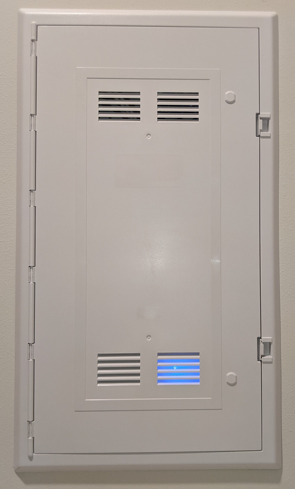
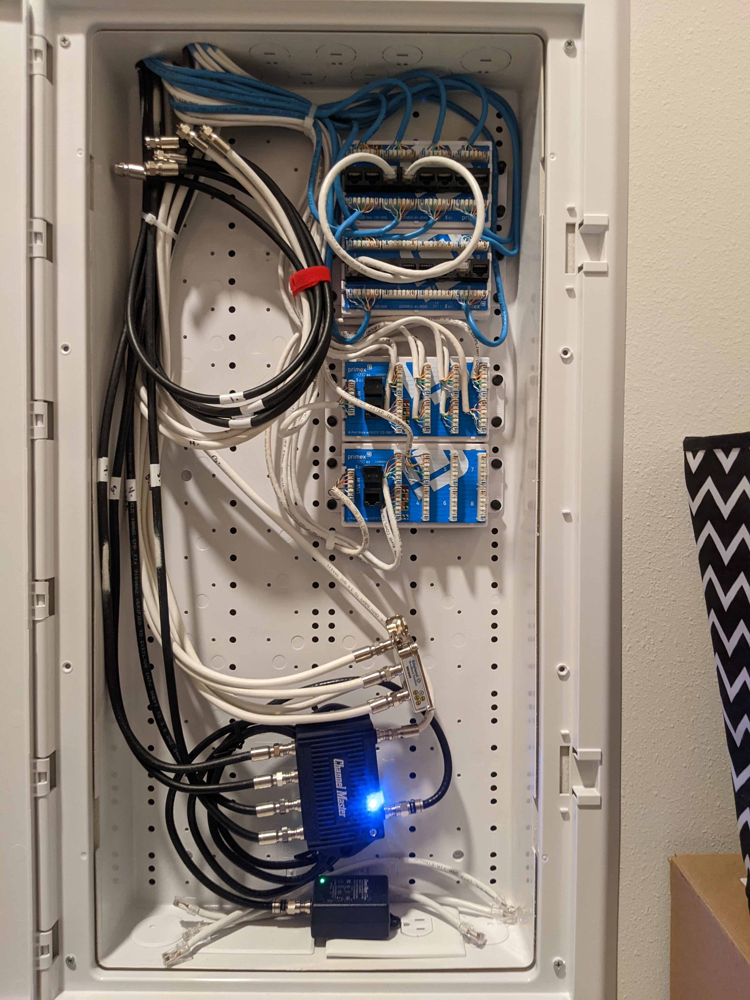
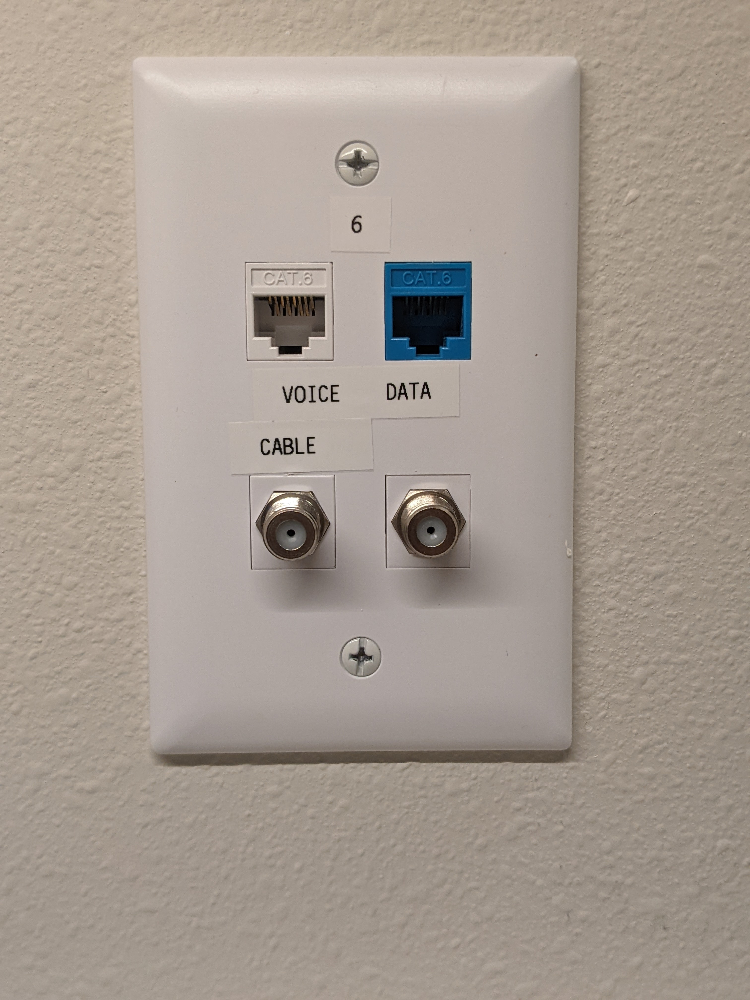
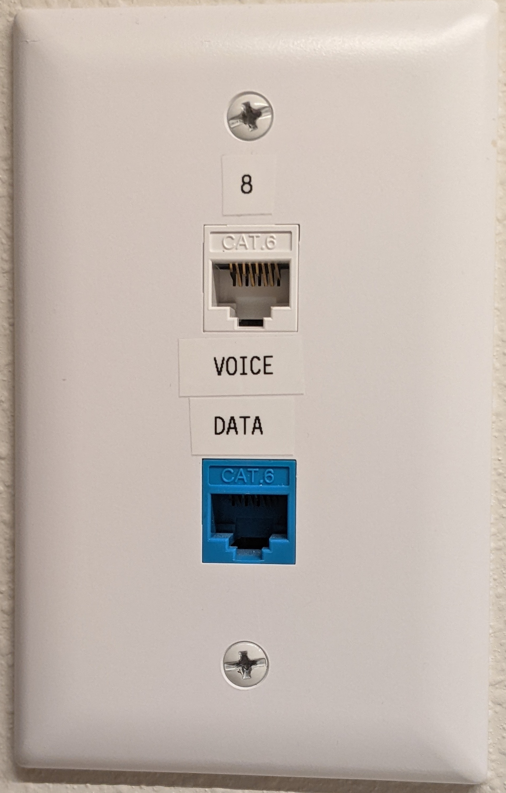
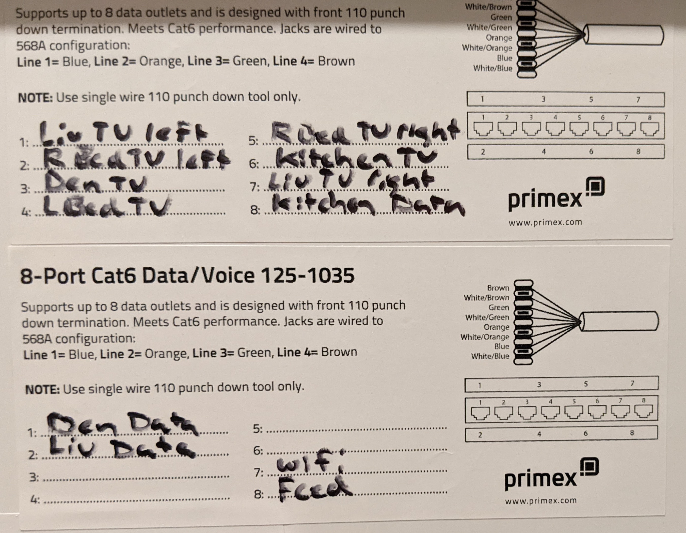
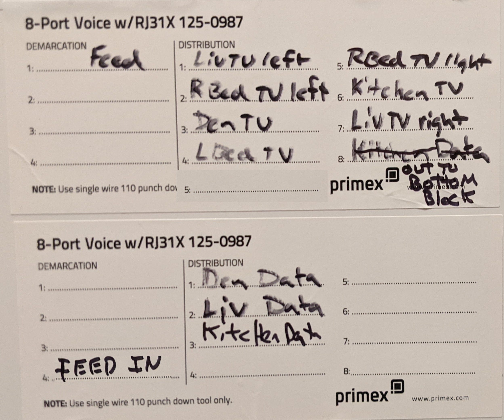

## We have Cable TV, Antenna Hookups, Telephone, WIFI, and Ethernet fed to our units.
-  There are five "wires" comming from a "secret room" in the building that bring those services to a distribution panel in our laundry rooms.
   -  High voltage is distributed through a "fuse box", Low voltage uses a "distribution cabinet"
      -  The special technicians that hooked up our services are called "Low Voltage Techs".     
   -  Engineers like to use the word "cable" for wires that don't carry high voltate electrical power.
      -  We will use the term "cable" from now on, so we seem "technical" too!
#### Here is a picture of that panel, along with what's inside.
<table>
	<tr>
		<th>Low Voltage Distribution Cabinet</th>
		<th>The "Guts" inside</th>
	</tr>	
	<tr> 
		<td>
			
		</td>
		<td>
			
		</td>
	</tr>
</table>

   -  Inside the low voltage distribution panel, a few simple devices spread services to wall jacks thoughout our units.
      -  Data (Ethernet) cables and Voice (Phone) cables connect to colorful gadgets that allow easier hookup.
         -  Some people call these gadgets "Patch Panels". Ours are "Mini" Patch Panels.
         -  The thinner Data (Ethernet) cables by convention are usually blue,  the thin Voice (phone) cables are usually white.
         -  True techno nerds call Voice cables "CAT 3" and Data (usually Ethernet) cable CAT 5E (sometimes CAT 6 - even better).
         -  TV and antenna cables are usually bigger, rounder, and stiffer than data and voice cables.
            -  They are called "coaxial Cables" due to their cross section and radial symmetry (Think Bullseye or Target).  
      -  The white Cable TV cables use a simple "splitter" to distribute that service around to rooms.
         -  Our little silver splitters just dangle there - one cable in and many cables out to the rooms.
      -  The "antenna" cables (Usually the thick black ones.) are not connected - You will notice no "spliter", they just hang there unused.
         - The fellow that took the pictures hooked his own antenna and splitter up.  Check out the gadget with the blue Light.

* * *

#### Here are pictures of the two kinds of jack plates most of us have on various walls.	 
-  An appropriate cable runs back to the distribution panel for each "port" or connector on these wall plates.
<table>
	<tr>
		<th>Spectrum calls these "TV"</th>
		<th>Spectrum calls these "Data"</th>
	</tr>	
	<tr> 
		<td>
			
		</td>
		<td>
			
		</td>
	</tr>
</table>

-  The technicians that installed our low voltage systems did an excellent job, labeling and organizing things consistently.
   -  Unfortunately, it's hard to be usefully verbose when writing on a cable, so an organizational legend is necessary.  
-  Each jack-plate is numbered, and the ports are labeled by by Spectrum for the service they provide.
   -  You could just note the number, and connect up cables in the panel from that.   
-  **To avoid crawling around, Spectrum provided two good legends that map wall plate names to cable numbers.**
-  Here's how Spectrum created names for wall plate locations.  (This took a while to figure out!)
    -  *Spectrun used the terms "TV" and "Data" to **name the plate type** as shown above.*
       -  "Data" plates have two square "ports", "TV" plates add two silver "F" connectors.
          -  Don't know why the are called "F" connectors - it's just a standard by some committee.  
       -  On the legend, the physical location and the plate type are combined into a location name.
    -  "Living Room TV" on the legend tells us which wall plate in the living room it refers to.
    -  "Living Room Data" on the legend tells us about a different type of wall plate in teh living room.
    -  Spectrum's legends might be more verbose.
       -  "Living Room TV Left" and "Living Room TV Right" are examples of two similar but nearby wall plate locations.
       -  "Living Room TV Left" and "Living Room Data Left" are examples of two different but nearby wall plate locations.
       -  Their gibberish will coincide with the layout of your unit.   
   -  The location names are in numbered boxes on the legends.
   -  The box number (in the legend table) denotes both the plate number and the numbers written on the cables to it.
      - All services will use the same cable number for a given wall plate.  Different cable type tell them apart.
-  Only the Ethernet data system and voice systems use patching gadgets with locations numbered on them accordingly.    
-  The Cable TV and unused antenna cables follow the same numbering system, but don't have mini patch panels.  They use splitters or sometimes amplified splitters.
   -  You get the number off your jack plate or infer from the legend on the door, and read a label stuck to the black or white cable.
#### Here is a picture of a Data Legend...
<table>
	<tr>
		<th>A Data legend in a typical AWP unit</th>
		<th>Comments</th>
	</tr>	
	<tr> 
		<td>
			
		</td>
		<td>
-  In this exmaple, two mini patch panels for Ethernet Data need two legend pieces. (More than 8 jacks)   
-  You make all the necessary connections short ethernet cables to the jacks on the data style mini patch panels to you router, hub, or switch. 
   -  In this case the ACTUAL feed is from WIFI, rather than from the "secret room"! 
      -  It's number 7 on the lower part of the legend.)  
      -  A short cable in the wall from each unit's WIFI feeds the unit's Ethernet Data system. 
      -  Your documentor speculates that this saves the cost of the equipment required in the "secret room" to supoprt a bunch of feeders, even though the cable goes down there.! 
      -  He also speculates that it might be easier to manage through the WIFI control gadgets.   
-  Note the entries Upper 1 and 7, lower 2.  All refer the the living room as seen from the door. 
   -  Also note that the plate type for lower #2 is Data rather than TV.  In box 2, "Liv Data" is plate # 2 and cable #2. 
		</td>
	</tr>
</table>

#### Here is a picture of a Voice Legend...
<table>
	<tr>
		<th>A Voice legend in a typical AWP Unit</th>
		<th>Comments</th>
	</tr>	
	<tr> 
		<td>
			
		</td>
		<td>
-  In this example, Two mini patch panels for phones (Voice) need two legend pieces. (More than 8 jacks)  
-  For Voice, everything - including the feed from "secret room" - connects to a special connector (called a punch down) located on its special mini patch panel.  The feed is noted as number 4 on the lower left part of the legend, even though there is only one "feed" cable, Spectrum documented it as being number 4 
      -  Since the 1920's telephone engineers called the place where their wire from the pole connected to your home's wire to the telephone on the wall "The Demarcation".  That custom remains as an easy way to note the in's and out's of voice cabling.   
-  Note the entries Upper 1 and 7, lower 2.  All refer the the living room as seen from the door. 
   -  Also note that the plate type for lower #2 is Data rather than TV.  In box 2, "Liv Data" is plate # 2 and cable #2. 
   -  The voice numbering matches the Data numbering for the living room and all others. 
   -  You can see that the plate types have nothing to do with the kind of service provided (Ethernet Data or Voice (Phones))
		</td>
	</tr>
</table>
