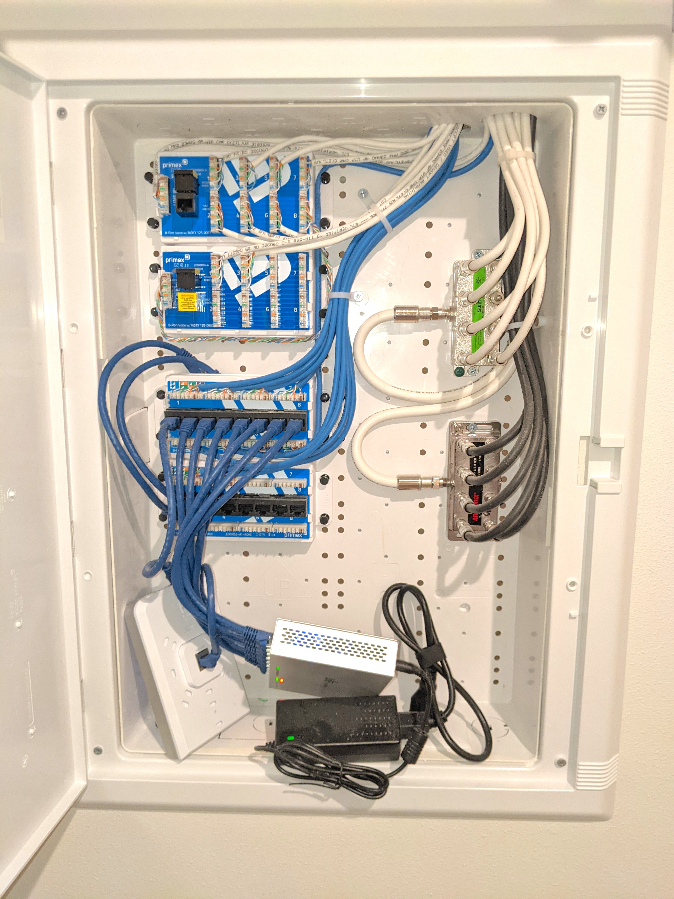
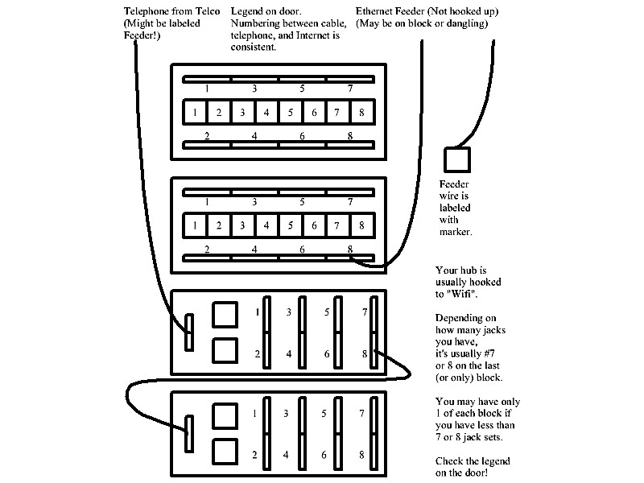

## We have Cable TV, Antenna Hookups, Telephone, WIFI, and Ethernet fed to our units.
-  There are five "wires" coming from a "secret room" (Called a Lan Closet or Splicing Chamber) -somewhere in the building- that bring those services to a set of little distribution panels in a plastic wall cabinet our laundry rooms.
   -  High voltage is locally distributed through a "fuse box", low voltage locally uses a "Distribution Cabinet" or "Distribution Panel".
      -  The technicians that hooked up our services are called "Low Voltage Techs".     
   -  Engineers like to use the word "cable" for wires that don't carry high voltage electrical power.
      -  We will use the term "cable" from now on, so we seem "technical" too!
#### Here is a picture of the Distribution Cabinet (usually in our laundry rooms), along with what's inside.
-  BTW... You can click on most of the pictures for a bigger view!
<table>
	<tr>
		<th>Low Voltage Distribution Cabinet</th>
		<th>The "Guts" Inside (Ideal Panel from Model) </th>
	</tr>	
	<tr> 
		<td>
			
		</td>
		<td>
			
		</td>
	</tr>
</table>

 -  Inside our low voltage distribution cabinets, a few simple devices spread services to wall jacks throughout our units via cables in the walls.
 -  The thinner Ethernet (data) cables by convention are usually blue,  the thin voice (phone) cables are usually white.
     -  True techno nerds call voice cables "CAT 3" and data cables (usually Ethernet) CAT 5E. (Sometimes CAT 6 - even better.)   
 -  Ethernet (data) cables and Voice (phone) cables connect to colorful gadgets that allow easier hookup.
     -  Some people call these gadgets "Patch Panels". Ours are "Mini" Patch Panels.
     -  A similar looking but electrically different mini patch panel is used for Ethernet and Voice respectively.
-  Ethernet patch panels have cables from the wall plates permanently connected to sets of eight jacks on that panel.
   -  They require short "Patch" cables that run from the Patch Panel to a Hub or Switch.
   -  Switches are more modern and better for many reasons compare to "HUB's.  
-  TV and antenna cables are usually bigger, rounder, and stiffer than data and voice cables.
   -  They are called "coaxial cables" due to their cross section and radial symmetry (Think bullseye or Target).  
   -  Our white cable TV cables use a simple "splitter" to distribute that service around to rooms.
         -  Our little silver splitters just dangle there - one cable in and many cables out to the rooms.
   -  Our "antenna" cables (Usually the thick black ones.) are not connected - You will notice no "splitter", they just hang  there unused.

#### Here is an annotated picture of typical Mini Patch Panels in our Distribution Cabinets
 
 
* * *

#### Here are pictures of the two kinds of wall plates most of us have on various walls.	 
-  An appropriate cable runs back to the distribution cabinet for each "port" or connector on these wall plates.
<table>
	<tr>
		<th>Spectrum calls these "TV"</th>
		<th>Spectrum calls these "Data"</th>
	</tr>	
	<tr> 
		<td>
			
		</td>
		<td>
			
		</td>
	</tr>
</table>

-  The technicians that installed our low voltage systems did an excellent job, labeling and organizing things consistently.
   -  Unfortunately, it's hard to be usefully verbose when writing on a cable, so an organizational legend is necessary.  
-  Each wall plate is numbered, and the ports are labeled by by Spectrum for the service they provide.
   -  You could just note the number, and connect up cables in the panel from that.   
-  **To avoid crawling around, Spectrum provided two good legends that map wall plate names to cable numbers.**
-  Here's how Spectrum created names for wall plate locations.  (This took a while to figure out!)
    -  *Spectrun used the terms "TV" and "Data" to **name the plate type** as shown above.*
       -  "Data" plates have two square "ports", "TV" plates add two silver "F" connectors.
          -  Don't know why the are called "F" connectors - it's just a standard by some committee.  
       -  On the legend, the physical location and the plate type are combined into a location name.
    -  "Living Room TV" on the legend tells us which wall plate in the living room it refers to.
    -  "Living Room Data" on the legend tells us about a different type of wall plate in teh living room.
    -  Spectrum's legends might be more verbose.
       -  "Living Room TV Left" and "Living Room TV Right" are examples of two similar but nearby wall plate locations.
       -  "Living Room TV Left" and "Living Room Data Left" are examples of two different but nearby wall plate locations.
       -  Their gibberish will coincide with the layout of your unit.   
   -  The location names are in numbered boxes on the legends.
   -  The box number (in the legend table) denotes both the plate number and the numbers written on the cables to it.
      - All services will use the same cable number for a given wall plate.  Different cable type tell them apart.
-  Only the Ethernet data system and voice systems use patching gadgets with locations numbered on them accordingly.    
-  The Cable TV and unused antenna cables follow the same numbering system, but don't have mini patch panels.  They use splitters or sometimes amplified splitters.
   -  You get the number off your wall plate or infer from the legend on the door, and read a label stuck to the black or white cable.
   -  **If you have both types of wall plates, the number of TV or Antenna cables will be less than Ethernet data jacks.**

 * * *

#### Here is a picture of a Data Legend...
<table>
	<tr>
		<th>A Data legend in a typical AWP unit</th>
		<th>Comments</th>
	</tr>	
	<tr> 
		<td>
			
		</td>
		<td>
-  In this example, two mini patch panels for Ethernet Data need two legend pieces. (More than 8 jacks)   
-  You make all the necessary connections short ethernet cables to the jacks on the data style mini patch panels to you router, hub, or switch. 
   -  In this case the ACTUAL feed is from WIFI, rather than from the Lan Closet! 
      -  It's number 7 on the lower part of the legend.)  
      -  A short cable in the wall from each unit's WIFI feeds the unit's Ethernet Data system. 
      -  Your documenter speculates that this saves the cost of the equipment required in the Lan CLoset to supoprt a bunch of feeders, even though the cable goes down there.! 
      -  He also speculates that it might be easier to manage through the WIFI control gadgets.   
-  Note the entries Upper 1 and 7, lower 2.  All refer the the living room as seen from the door. 
   -  Also note that the plate type for lower #2 is Data rather than TV.  In box 2, "Liv Data" is plate # 2 and cable #2. 
		</td>
	</tr>
</table>

* * *

#### Here is a picture of a Voice Legend...
<table>
	<tr>
		<th>A Voice legend in a typical AWP Unit</th>
		<th>Comments</th>
	</tr>	
	<tr> 
		<td>
			
		</td>
		<td>
-  In this example, Two mini patch panels for phones (Voice) need two legend pieces. (More than 8 jacks)  
-  For Voice, everything - including the feed from Lan Closet or Splicing Chanber - connects to a special connector (called a punch down) located on its special mini patch panel.  The feed is noted as number 4 on the lower left part of the legend, even though there is only one "feed" cable, Spectrum documented it as being number 4 
      -  Since the 1920's telephone engineers called the place where their wire from the pole connected to your home's wire to the telephone on the wall "The Demarcation".  That custom remains as an easy way to note the in's and out's of voice cabling.   
-  Note the entries Upper 1 and 7, lower 2.  All refer the the living room as seen from the door. 
   -  Also note that the plate type for lower #2 is Data rather than TV.  In box 2, "Liv Data" is plate # 2 and cable #2. 
   -  The voice numbering matches the Data numbering for the living room and all others. 
   -  You can see that the plate types have nothing to do with the kind of service provided (Ethernet Data or Voice (Phones))
		</td>
	</tr>
</table>

#### There are no legends for Cable TV and Antenna (Not labeled on every wall plate.)
#### You need to look up a location on the data or voice legends and then check the labels on the cables themselves.

* * *

### Here is a diagram of the 4 mini patch panels in a typical AWP distribution cabinet.
- Some units may have only one of each type if they did not add any wall plates during the sales process.
  -  The top two boxes depict the mini patch panels for Ethernet data.
     -  We need a ethernet compatible hub, router, or switch and short ethernet cables to jumper various jacks together.
  -  The bottom two boxes represent the mini patch panels for our unit's telephone system.
     -  All of the cables that run to various wall plates in rooms are already connected.
        -  The authors bottom mini patch panel was not hooked up, the missing short jumper is depicted between them on this diagram!  It had to be fixed.  

* * *

#### Here is a picture of a Distribution Cabinet with Patch Panels inside (From a Resident).
-  Spectrum did not not hook up our antenna cables so this resident purchased his own antenna and splitter.
-  Note the white tape labels the black TV and the scribbled numbers on white antenna (coaxial cables)!

* * *

#### Here is a picture of a typical WIFI Access Point.
-  Most of us will find one of these in their coat closet near the front door.
-  An Ethernet cable runs from the top wall plate jack to the nearest Lan Closet.  Labeled "IDF" - see notes below.
-  Another Ethernet cable runs through the walls into our distribution cabinets.  Labeled as "WIFI".
-  By using the short cable from the WIFI AP to our Distribution Closeet, they save the cost of gadgets downstairs to support the dedicated feeder that we MIGHT use for Ethernet.  The Ethernet signal is sorted out by software inside the WIFI Aaccess Point instead and just sent a short distance to us from the spare port on the AP.

* * *

#### A bigger Picture.  TLDR:  (Too Long, Don't Read - Really!)
-  **Various cables that provide our digital (internet) and analog (Television) services make many "hops" to get to the building and then to our individual units.**

-  Our Service Providers use bits of equipment spread around the local (and national) area to get their digital and analog "signals" to us.
-  In their building or sometimes one of many local structures, they have a secure room that contains large racks of equipment used to fan out or distribute their cables around the general area.  This room is called an "MDF" or Main Distribution Frame.
   -  The MDF is usually in a secure-locked room or other secure place dedicated to it.
      -  Depending on the industry or service, their MDF might be located in an underground vault (Power), a splicing chamber (Telephone), or just a little box buried somewhere (Cable and Internet).  
-  They have smaller locations closer to customers that further "fan" the signal to individual customers.  This room full of equipment is called an "IDF" or Independant Distribution Frame.  Sometimes, it's just a little buried "box".   
-  Big (armoured) cables from each provider's IDF come to a local room called the "Demark" - short for demarcation.  Ours is located in a special secure room in our garage.
    -  A "demarc" has various specialized connection panels and is usually the building's MDF.
    -  The demarc is the place where their cables and wires connect to our cables and wires.  Our MDF is located in our Demarc.
    -  Sometimes, each service has their own demarcation.  In either case we are legally responsible for our cables and gadgets, and they are responsible for theirs outside the demarc.
    -  There is a "no man's land" that both parties use.  It is ususally split into two parts, with each party having a key to their part.  (The grey telephone boxes on modern homes are Demarcs!)  
-  The whole MDF / IDF thing is repeated inside the buildling.
   -  Our MDF is in our Demarc.  There is not much stuff for our services in there, mostly electrical stuff.  Most of the work for us is done in the IDF.
      -   Our electrical system is also very nice and well done.  (Another document.)
   -  Our IDF's are located in the second floor storage areas.  They contain Ethernet patch panels switches, Telephone splicing panels, security control gadgets,  door controls, fire controls etc.
      -  These gadgets collectively fan out their service's cables to individual units or to other gadgets throughout the building.  (Cameras, doors, fire alarms, etc.)
