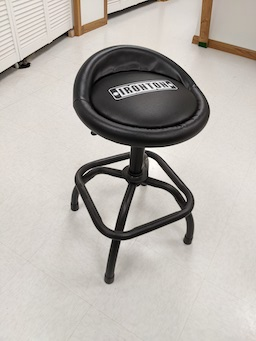
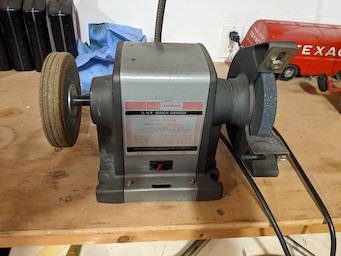
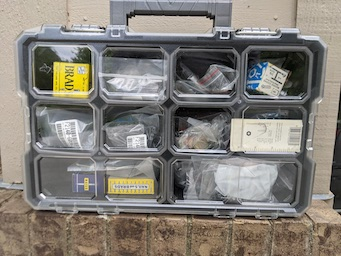

### Examples of items that are not big power tools

<table>
  <tr>
    <th>An Ugly but Straight Bench.   Maybe a Table Saw extension?   New Top!</th>
     <th>24 by 48 Wire Rack Shelf</th>
     <th>Tool Chest (Clean - Refurbished)
  </tr>
  <tr>
    <td valign="top">
    
      </td>
    <td valign="top">
      
      </td>
      <td valign="top">
      
      </td>
  </tr>
 </table>
 
 
 <table>
  <tr>
    <th>A proper Oxy/Aceteline Torch Setup</th>
     <th>Useful Torch Accessories</th>
    <th>An Example Shop Vac (Handy to Have Two?)</th>
  </tr>
  <tr>
    <td valign="top">
    
      </td>
    <td valign="top">
      
      </td>
      <td valign="top">
      
      </td>
  </tr>
 </table>

 <table>
  <tr>
    <th>Comfy Work Stool</th>
     <th>A Smooth Bench Grinder (Guard off to Buff)</th>
    <th>Sorted Fasteners (1 of 2)</th>
  </tr>
  <tr>
    <td valign="top">
    
      </td>
    <td valign="top">
      
      </td>
      <td valign="top">
      
      </td>
  </tr>
 </table>
