### Examples of items that are not big power tools - No Acceptance or rejection implied - Just Suggestions!
- For Example:
  - One of the fellows said that he had a tenon jig, but didn't mentino that he had a router.
    - John has a little-used but really cheap router to offer, but it isn't rigid enough to be precise.
      - [How about a nice "CNC" Hand-held Router](https://youtu.be/QxjE5WOAGi4)
        - If I had one, I'd share it!
      - [How about any other computer controlled tool?](https://store.bantamtools.com/products/bantam-tools-desktop-cnc-milling-machine)
      - [There are many unique hand tools - here's one example](./Box-Ratchet.jpg)
<table>
  <tr>
    <th>An Ugly but Straight Bench.   Maybe a Table Saw extension?   New Top!</th>
     <th>24 by 48 Wire Rack Shelf</th>
     <th>Tool Chest (Clean - Refurbished)
  </tr>
  <tr>
    <td valign="top">
    
      </td>
    <td valign="top">
      
      </td>
      <td valign="top">
      
      </td>
  </tr>
 </table>
 
 
 <table>
  <tr>
    <th>A proper Oxy/Aceteline Torch Setup</th>
     <th>Useful Torch Accessories</th>
    <th>An Example Shop Vac (Handy to Have Two?)</th>
  </tr>
  <tr>
    <td valign="top">
    <a href="./Torch.jpg">
      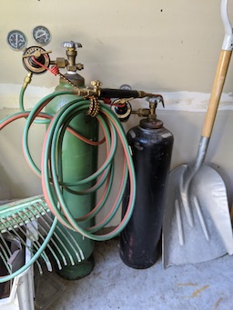
      </a>
      </td>
    <td valign="top">
      <a href="./Torch-Parts.jpg">
      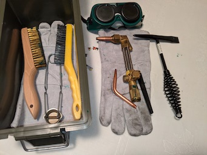
      </a>
      </td>
      <td valign="top">
      <a href="./Shop-Vac.jpg">
      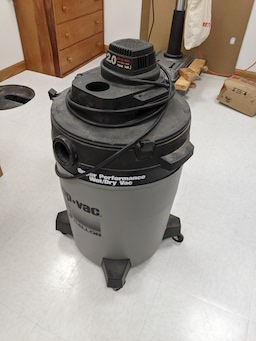
      </a>
      </td>
  </tr>
 </table>

 <table>
  <tr>
    <th>New Hand Grinder</th>
     <th>Digital Caliper (Example measurment tool)</th>
    <th>Cordless Drill and Driver</th>
  </tr>
  <tr>
    <td valign="top">
    <a href="./Eric-S--Dremel.jpg">
      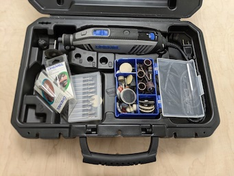
      </a>
      </td>
    <td valign="top">
      <a href="./Eric-S-Caliper.jpg">
      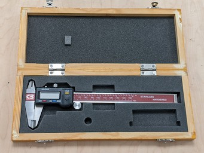
      </a>
      </td>
      <td valign="top">
      <a href="./Eric-S-Coredless.jpg">
      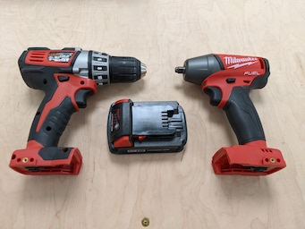
      </a>
      </td>
  </tr>
 </table>

 <table>
  <tr>
    <th>New Fire Extinguisher (Good example at least)</th>
     <th>New Forstner Bits (Purchased for a Project</th>
    <th>Example - We will need a computer    This one is old, but HD and very clean   Employer Paid +4K - Offer a better one!</th>
  </tr>
  <tr>
    <td valign="top">
    <a href="./Eric-S-Fire.jpg">
      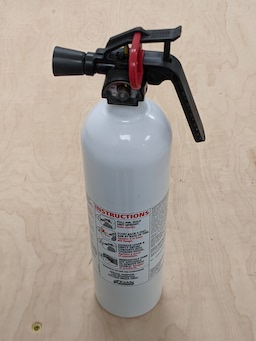
      </a>
      </td>
    <td valign="top">
      <a href="./Eric-S-Forstner.jpg">
      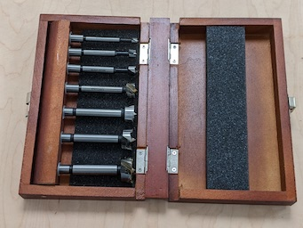
      </a>
      </td>
      <td valign="top">
      <a href="./Eric-S-Laptop.jpg">
      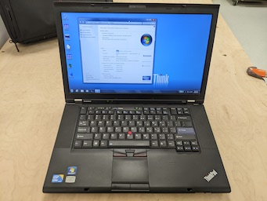
      </a>
      </td>
  </tr>
 </table>

 <table>
  <tr>
    <th>Drawer of Examples 1 </th>
     <th>Drawer of Examples 2 </th>
    <th>Drawer of Examples 3    Contains some weirdo's Hog Ring Pliers, Lineman's Pliers   Snap-Ring Pliers   GAS Pliers, Ferrule Pliers</th>
  </tr>
  <tr>
    <td valign="top">
    <a href="./Eric-S-Drawer-1.jpg">
      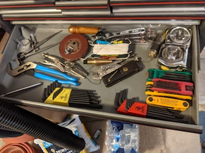
      </a>
      </td>
    <td valign="top">
      <a href="./Eric-S-Drawer-2.jpg">
      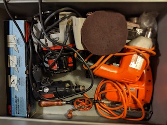
      </a>
      </td>
      <td valign="top">
      <a href="./Eric-S-Drawer-3.jpg">
      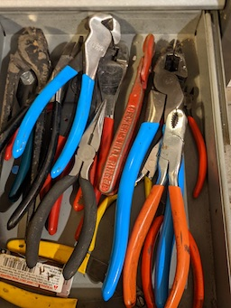
      </a>
      </td>
  </tr>
 </table>
