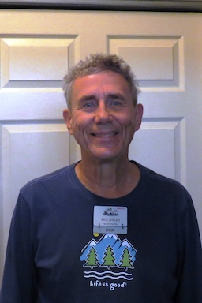

	
 #### Rick's Profile
<table>
  <tr>
    <th>RIck</td>
    <th>Profile and Interests</td>
  </tr>
  <tr>
      <td valign="top">
      
      </td
  <tr>
      <td valign="top">
		  - I graduated from Milwaukee School of Engineering in 1968.  
		  - I was drafted shortly after and enlisted in the USAF.  
		  - After my 4 year commitment, I hired on as an engineer / project coordinator with the FAA.  
		      - We spent 14 years in Alaska where I fell in love with the mountains and outdoor activities.
		  - My current hobbies are mostly outdoor activities: softball, tennis, pickleball, bird watching, hiking, photography, etc.         - I am very active in our church choir both in Apple Valley and Mesa, AZ.  			 
      </td>
  </tr>
 </table>	
 