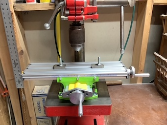

### Possible offerings from Ralph L.

<table>
  <tr>
    <th>Rigid Work Support</td>
    <th>Delta Drill Press</td>
    <th>10" Compound Miter</td>
    <th>10" Ryobi Table Saw</td>   
  </tr>
  <tr>
      <td valign="top">
      
      </td>
         <td valign="top">
      
      </td>
        <td valign="top">
      
      </td>
        <td valign="top">
      
      </td>
  </tr>
 </table>
 
- Click thumbnails for Hi Def Pictures)

<table>
  <tr>
    <th>Ralph recently purchased this 2 Axis Cross Table for his Drill Press</td>
    <th>Mounted on his 1946 Drill Press!</td>
    <th>Another View</td>
  </tr>
  <tr>
      <td valign="top">
      
      </td>
      <td valign="top">
      
      </td>
      <td valign="top">
      
      </td>      
      </table>
 <table>
 <tr>
 <th> Ralph recently sent a picture of a new vice for his milling table outfit. </td>
 </tr>
 <tr>
 <td valign="top">
      
 

  #### Some other tools...
- 7 1/4" Circular Saw (Rockwell)
- 4.5 Amp Variable Speed Jigsaw (Black & Decker)
- Cordless Powered Hand Saw (Black & Decker)
- Airgrip Multitaskit Lazer Level (Ryobi)
- 18v 1/2" Cordless Drill/Driver (Master Force)
- 6v 1/2" Cordless Drill (Black & Decker)
- Orbital Sander (Rockwell)
- Woodworking Hand Tools
- 6 Gallon Wet/Dry Shop Vacuum (Genie Jet Vac)
- St. Paul Technical College Cabinetmaking Hand Tools & Manuals (my son has Diploma in Cabinetmaking
