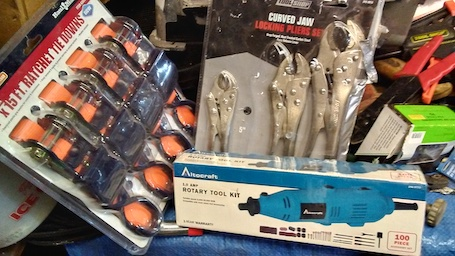
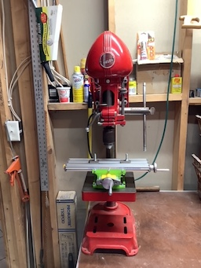

# Applewood Pointe Workshop

#### If you are new the the Apple Valley Workshop Group, or this is your first time here...

- Use the link below to see some introductory information. 
[Click here to see the "New Guy" page.](./Collateral/newguy.md) 

* * *

## News
-  Five CraftsMen recent met to discuss tool submissions and next steps to getting organized.
   - Here are the "minutes of that meeting...
   
   In Attendance:  Linelle Johnson, Ralph Lavansky, Dave Porter, Eric Strandjord, & Jack Weidenbach

The attached 1:00 P.M. Tuesday, December 20th, 2022, Meeting Agenda was followed (see attached below).

All of our pending Workshop Users have now submitted their Tools / Equipment that they are considering donating to the Workshop for us to make our selections from, or have stated that they prefer we just choose from those already submitted by others.

The group went through the " APAV Workshop User Tools / Equipment Submitted" report and picked what was thought to be the best, to recommend to all to vote on (see attached below).

Eric showed examples of his selection software and group chose the one sheet pictures of each type with voting boxes to be checked next to pictures on it.  Group indicated that the recommended ones would be indicated on the sheets of each type.  And suggested that only ones we need to vote on (more than one item or number of items we want to keep) be dispersed - on website or email only, with deadline and if they don't vote just go with votes received (to be reviewed before results are sent out).  Also to include voting item asking if they prefer to just go with what others vote on, and not to vote themselves.

Communication to be sent to all users prior to the end of the year - thanking all for getting their Tools / Equipment considerations in and letting them know what we feel will be next.

The Meeting was adjourned at 4:00 P.M. .

***

- Stacy from AppleWood Pointe published some construction photos.  
[Link to her Flickr collection.](https://www.flickr.com/photos/26824342@N00/sets/72177720299873393)
- Rick-S sent some information about himself.  [Link to Rick's Profile.](./CraftsMen/Rick-S/Profile.md)
- Gary-L Also sent a bit of information about himself. [Link to Gary's Profile.](./CraftsMen/Gary-L/Profile.md) 
- Linelle-J added a 1" Belt Sander and a Scoll Saw to his list.  
- To prepair for Phase Two of our Shop Planning,  This website has been updated.
  - Nothing has been deleted.  Old news has it's own page. You can also use the old mainpage if you wish!
  - [Link to Old News.](./Collateral/OldNews.md)
  - [Link to the original main page.](./Collateral/Original.md)
  - We will move from humbly asking for tool pcitures, etc - To actually getting organized!
  - John-B is building a consolidated page for profiles to help us get to know each other.
    - (Send him your info.  It's easy to add you!)
    - [Here's the link](./Collateral/Profiles.md) 
  
  * * *
  
## Here's what our shop might look like.  (To scale, with scaled objects.)
-  NOTE!  Last Month, we got a better drawing of the shop!  
   - (The door has moved, and the size is 1.5 feet smaller across.  We get storage!!!) 
   - [Link to new Dimensioned Drawing of Shop.](./Collateral/Shop-11-06-22.jpg)
   - [Link to Simplified Drawing of Shop.](./Collateral/Plans/Shop.JPG)
   - If you want a Scaled PDF of the simplified Shop Drawing, see the last entry in the Documents Collection
   - [Link to the PDF Documents Collection.](./Documents/Download.md)
   - AWP won't furnish much for the space.
     - Benches, cabinets, chests, and storage need consideration.
     - [Click here to see Sample accessories.](./Collateral/accessories.md)

- Here is a new rendering.  Furnishings and tools arbitrarily located for scale only. 
 

 
 ***
 
## Workshop Email List
- Please email johnathan.binford@gmail.com for a copy of the list.
- Thanks to all for keeping our email list up to date.
  - Please email johnathan.binford@gmail.com with any updates. 
 
* * *
## Craftmen's Profiles...
-  A picture and a bit of information about our CraftsMen could help us get to know each other!
   -  [Link to the new Profile Page!](./Collateral/Profiles.md)

* * *

## The Proposed Applewood Pointe of Apple Valley Workshop Manual is Complete! 
1. Initially, until ownership transfers to the resident Board of Directors (see item 3),  
we must abide by the builder provided Applewood Point of Apple Valley's single page SHOP SAFETY RULES.
2. No other Workshop policies or manuals may be used until handover. 
3. Once the resident Board of Directors has been established, 
our group's more comprehensive Workshop Users Manual may be adopted.
  - Compiled with input from us Workshop Users, we believe this more comprehensive Workshop Users Manual  developed based upon our needs, concerns, and recommendations better meets our Workshop User needs.   This draft, to be revisited for final review when the above takes place,  will be kept held on our Workshop Website:  www.github.com/johnbinford/applewoodpointe 

- [Link to the PDF Documents Collection.](./Documents/Download.md)
  - (Some browsers might then show a "spinning" icon - if yours does,  just click the download button on the right.)

***
  
### Links
- The "Back" button on your browser is the best wasy to backup from links (Throughout this Repository).

[Link to Eric's Letter from the first luncheon.](./Collateral/JohnBinford-1.md)

[Link to Schematic of Garage.](./Collateral/Garage-H.jpg)

[Link to new Dimensioned Drawing of Shop.](./Collateral/Shop-11-06-22.jpg)

[Link to new Simplified Drawing of Shop.](./Collateral/Plans/Shop.JPG)

[Link to Apple Valley Planning Document.](https://documents.applevalleymn.gov/WebLink/DocView.aspx?id=512623&dbid=0&repo=lf-city)

[Link to the WEIS webams - now with TimeLapse!](https://nbphotos.weisbuilders.com/2022projects/221609/)

[Link to Pictures from the Maple Grove Shop.](./Other-Shops/Maple-Grove/readme.md)

[Link to Pictures from the Eagan Shop.](./Other-Shops/Eden-Prarie/readme.md)

[Link to Pictures from the Eden Prarie Shop.](./Other-Shops/Eden-Prarie/readme.md)

[Link to Pictures from the GreenHouse Shop.](./Other-Shops/GreenHouse/readme.md)

[Link to Pictures from the Valley West and Southtown Shops](./Other-Shops/Valley-South/readme.md) 

[Link to Online Manual.](./Documents/Manual.md) 

[Link to Online Waiver.](./Documents/Waiver.md)
    
[Link to the PDF Documents Collection.](./Documents/Download.md)

[Link to Aerial View (Drawing).](./Collateral/Aerial-1.png) 

[Link to Topographical View (Drawing).](./Collateral/Aerial-Topo.png) 

[Link to Building Elevations (Drawing).](./Collateral/Building-Elevations.png) 

* * *
* * *

## Submissions from Craftsmen!
- All 20 CraftsMen have now communicated their wishes concerning Tools and Equipment.
- The fellows that submitted their list of Tools / Equipment for us to possibly select  from are noted below with an " * ".
- Those that prefer we choose from those submitted by others (or offered some nice hand tools) carry no mark.
  - (A couple potential CraftsMen prefer to stay anonymous)
- Len-B  *
- Len-C  *
- Jim-E	 *
- Mark-G  *
- Linelle-J  *
- David-J  
- Harold-L  
- Ralph-L  *
- Gary-L  *
- Dick-M
- Dave-P  *
- Mark-S
- Kevin-S
- Rick-S  *
- Eric-S  *
- Dick-V
- Jack-W  *
- Jim-W	 *
- Dave-Z

* * *

###  Pictures of our CraftMen's Submissions follow.
*(Click a Pictiure for a High Definition Version!)* 

####  Len-B's Submissions.
<table>
  <tr>
    <th>Drill Press</td>
    <th>Planer</td>
  </tr>
  <tr>
      <td valign="top">
      
      </td>
      <td valign="top">
      
      </td>
  </tr>
 </table>

<table>
  <tr>
    <th>Router-Jigsaw</td>
    <th>Scrollsaw</td>
  </tr>
  <tr>
      <td valign="top">
       
      </td>
      <td valign="top">
      
      </td>
  </tr>
 </table>
 
* * *

####  Len-C's Submissions.

<table>
  <tr>
    <th>Delta Band Saw</td>
    <th>Bench Drawers</td>
    <th>Drill Press</td>
  </tr>
  <tr>
      <td valign="top">
      
      </td>
      <td valign="top">
      
      </td>
      <td valign="top">
       
      </td>
  </tr>
 </table>
 
 <table>
   <tr>
     <th>Sanding-Table</td>
     <th>Sorted-Fasteners</td>
     <th>Table-Saw</td>
   </tr>
   <tr>
       <td valign="top">
       
       </td>
       <td valign="top">
       
       </td>
       <td valign="top">
        
       </td>
   </tr>
  </table>
  
 <table>
   <tr>
     <th>WorkBench</td>
   </tr>
   <tr>
       <td valign="top">
       
       </td>
       </tr>
  </table>
 
* * *

#### Jim-E's Submissions.
<table>
  <tr>
    <th>A steel shelf.</td>
    <th>A workbench.</td>
  </tr>
  <tr>
      <td valign="top">
      
      </a>
      </td>
      <td valign="top">
      
      </a>
      </td>
  </tr>
 </table>
<table>
  <tr>
    <th>A couple more workbenches.</td>
    <th>A nice tool chest.</td>   
  </tr>
  <tr>
      <td valign="top">
      
      </a>
      </td>
        <td valign="top">
      
      </a>
      </td>
  </tr>
 </table>

- Jim has a large assortment of Bessel Clamps and some nice Ryobi handheld tools!

***

#### Mark-G's Submissions.
 
<table>
  <tr>
    <th>Two Husky Tool Chests  (Tools Inside!) </td>
  </tr>
  <tr>
      <td valign="top">
      
      </td>
</table>

***

#### David-J's Submissions.
<table>
  <tr>
    <th>Anyone want to buy a nice chainsaw sharpener? </td>
  </tr>
  <tr>
      <td valign="top">
      
      </td>
</table>

***

#### Linelle-J's Submissions.
<table>
  <tr>
    <th>Band-Saw</td>
    <th>Belt-Sander</td>
    <th>Drill-Press</td>
  </tr>
  <tr>
      <td valign="top">
      
      </td>
      <td valign="top">
      
      </td>
      <td valign="top">
      
      </td>
  </tr>
 </table>

<table>
  <tr>
    <th>Dust-Collector</td>
    <th>Table-Saw</td>
    <th>Miter-Saw</td>
  </tr>
  <tr>
      <td valign="top">
      
      </td>      
      <td valign="top">
      
      </td>
      <td valign="top">
      
      </td>
  </tr>
 </table>

 <table>
  <tr>
    <th>Drum Sander</td>
    <th>Planer-2</td>
    <th>Router-Table</td>
  </tr>
  <tr>
      <td valign="top">
      
      </td>
      <td valign="top">
      
      </td>
      <td valign="top">
      
      </td>
  </tr>
 </table>
  <table>
  <tr>
    <th>1" Belt-Sander</td>
    <th>Scroll Saw</td>
  </tr>
  <tr>
      <td valign="top">
      
      </td>
      <td valign="top">
      
      </td>
            <td valign="top">
      
      </td>
  </tr>
 </table>
-  Linelle recently added a few more items to his list.  (Unpictured)
   -  36 x 12 Inch Lalthe
   -  17 Inch Drum Sander
   -  Scroll Saw

***

#### Ralph-L's Submissions.

<table>
  <tr>
    <th>Rigid Work Support</td>
    <th>Milling Machine Table on Drill Press</td>
    <th>10" Compound Miter</td>
    <th>10" Ryobi Table Saw</td>   
  </tr>
  <tr>
      <td valign="top">
      
      </td>
      </td>
      <td valign="top">
      
      </td>
        <td valign="top">
      
      </td>
        <td valign="top">
      
      </td>
  </tr>
 </table>
 
- Click thumbnails for Hi Def Pictures)

  ##### Some other tools...
- 7 1/4" Circular Saw (Rockwell)
- 4.5 Amp Variable Speed Jigsaw (Black & Decker)
- Cordless Powered Hand Saw (Black & Decker)
- Airgrip Multitaskit Lazer Level (Ryobi)
- 18v 1/2" Cordless Drill/Driver (Master Force)
- 6v 1/2" Cordless Drill (Black & Decker)
- Orbital Sander (Rockwell)
- Woodworking Hand Tools
- 6 Gallon Wet/Dry Shop Vacuum (Genie Jet Vac)
- St. Paul Technical College Cabinetmaking Hand Tools & Manuals (my son has Diploma in Cabinetmaking

* * *

#### Gary-L's Submissions.
<table>
  <tr>
    <th>12 Inch Miter Saw</th>
    <th>Bench Grinder</th>
    <th>Orbital Sander</th>
  </tr>
  <tr>
      <td valign="top">
      
      </td>
      <td valign="top">
      
      </td>
      <td valign="top">
      
      </td>
  </tr>
 </table>

<table>
  <tr>
    <th>Compressor</th>
    <th>Good Brush</th>
    <th>Hand Truck</th>
  </tr>
  <tr>
 <td valign="top">
      
      </td>      
      <td valign="top">
      
      </td>
      <td valign="top">
      
      </td>
  </tr>
  </table>

 <table>
  <tr>
    <th>Lapidary Table</th>
    <th>Rock Drill</th>
    <th>Rock Saw</th>
    <th>Shop Vacuum</th>		
  </tr>
  <tr>
      <td valign="top">
      
      </td>
      <td valign="top">
      
      </td>
      <td valign="top">
      
      </td>
      <td valign="top">
      
      </td>
  </tr>
  </table>

***

 #### Dave-P's Submissions
 
 <table>
  <tr>
    <th>Table Saw</td>
    <th>Band-Saw</td>
    <th>Jointer</td>
  </tr>
  <tr>
      <td valign="top">
      
      </td>
      <td valign="top">
      
      </td>
      <td valign="top">
      
      </td>
  </tr>
 </table>

<table>
  <tr>
    <th>Drill Press</td>
    <th>Dust-Collector</td>
  </tr>
  <tr>
 <td valign="top">
      
      </td>      
      <td valign="top">
      
  </tr>
 </table>
 #### Dave also has a large collection of hand tools and portable power tools! 

* * *

#### Eric S's Submissions

<table>
  <tr>
    <td>Rigid Drill Press</td>
     <td>14" Delta Bandsaw</td>
    <td>Other Tools</td>
  </tr>
  <tr>
      <td valign="top">
      
      </td>
      <td valign="top">
      
      </td>
      <td valign="top">
       
      </td>
  </tr>
 </table>
   
 <table>
   <tr>
     <th>Ryobi Belt Sander  With Bench Mount   (Note Square Profile)</td>
     <th>Semi-Portable Table Saw   (Iron has surface rust,  Mechanics Recently Rebuilt)  Naval Jelly Purchased :-) </td>
     <th>Compressor</td>
   </tr>
   <tr>
       <td valign="top">
       
       </td>
       </td>
       <td valign="top">
       
       </td>
       <td valign="top">
        
       </td>
   </tr>
  </table>
   
  
   #### Some other tools...
  
- Porter Cable Circular Saw (New)
- Two Metal Tool Cabinets (Drawers)
- Lots of Mechanic's Tools
- Cheap Square Pad Sander
- Ryobi 18" Belt Sander with Bench Mount
- Like all of us, I have a small collection of handheld power tools, and various hand tools.
- Specialty tools for electronic projects, with some test gear (Meters, power supply, Oscilloscope, etc.)
 

- Also have a Prusa 3DMK3S 3D printer and all the stuff needed to create and print projects.
  - I may keep upstairs.  
  - It would be nice to know if anyone shares this interest.

 * * *

#### Jack-W's Submissions
<table>
  <tr>
    <th>Dewalt Planer</td>
    <th>PowerMatic Band Saw</td>
    <th>Some Nice Clamps, etc.</td>
  </tr>
  <tr>
      <td valign="top">
      
      </td>
      <td valign="top">
      
      </td>
      <td valign="top">
      
      </td>
  </tr>
 </table>

<table>
  <tr>
    <th>Dust Collector</td>
    <th>Rikon Wet Sharpener</td>
    <th>Nice Dust Filer</td>
  </tr>
  <tr>
 <td valign="top">
      
      </td>      
      <td valign="top">
      
      </td>
      <td valign="top">
      
      </td>
  </tr>
 </table>

<table>
  <tr>
    <th>Tool Chest</td>
    <th>Work Bench</td>
    <th>Bench Holes</td>
  </tr>
  <tr>
 <td valign="top">
      
      </td>      
      <td valign="top">
      
      </td>
      <td valign="top">
      
      </td>
  </tr>
 </table>

<table>
  <tr>
    <th>Craftsman Tool Chest</td>
    <th>Lumber for NEW Workbench</td>
    <th>Another Nice Tool Chest.</td>
  </tr>
  <tr>
      <td valign="top">
      
      </td>
      <td valign="top">
      
      </td>
      <td valign="top">
      
      </td>
  </tr>
 </table>

 <table>
  <tr>
    <th>Other Tools</td>
    <th>(More Tools)</td>
  </tr>
  <tr>
     	<td valign="top">
	- Milwaukee 4x24 belt sander 
	- Bosch random orbit sander 
	- Makita random orbit sander 
	- Ryobi biscuit joiner 
	- Makita power plane 
      	</td>
      	<td valign="top">
	- Makita water stone power sharpener 
	- Porter Cable detail sander 
	- Porter Cable Brad nailers (2) 
	- Drills and bits. Some Forster, brad point, twist bit, etc 
	- Various other shop items and supplies. 	</td>	
  </tr>
 </table>

* * *

#### Jim-W's Submissions.

<table>
  <tr>
    <th>Air Filter 1</td>
    <th>Dust Collector 1</td>
    <th>Dust Collector 2</td>
  </tr>
  <tr>
      <td valign="top">
      
      </td>
      <td valign="top">
      
      </td>
      <td valign="top">
      
      </td>
  </tr>
 </table>

<table>
  <tr>
    <th>Air Filter 2</td>
    <th>Miter</td>
    <th>Oscillating Sander</td>
  </tr>
  <tr>
 <td valign="top">
      
      </td>      
      <td valign="top">
      
      </td>
      <td valign="top">
      
      </td>
  </tr>
 </table>

 <table>
  <tr>
    <th>Router Table</td>
    <th>Planer</td>
    <th>Radial Arm Saw</td>
  </tr>
  <tr>
      <td valign="top">
      
      </td>
      <td valign="top">
      
      </td>
      <td valign="top">
      
      </td>
  </tr>
 </table>
 
  <table>
  <tr>
    <th>Grizzley Bandsaw</td>
    <th>Jointer</td>
    <th>HVLP Spray Outfit</td>
  </tr>
  <tr>
      <td valign="top">
      
      </td>
      <td valign="top">
      
      </td>
      <td valign="top">
      
      </td>
  </tr>
 </table>

 <table>
  <tr>
    <th>Workbench</td>
    <th>Workbench</td>
  </tr>
  <tr>
      <td valign="top">
      
      </td>
      <td valign="top">
      
  </tr>
 </table>
 
##### Jim has a nice Biscuit Joiner and a Dovetail Jig
##### Jim also has a large collection of power hand tools! 
 
