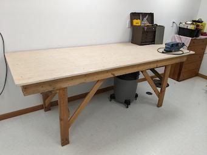
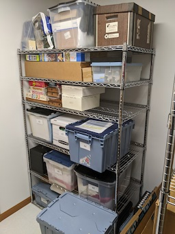

# News
#### Recent updates to this website.
  - Jack-W just submitted some nice tools!
  - Linelle-J recently submitted 10 nice tools!
  - Ralph-L recently submitted a few nice tools!
  - THe pictures of the Eden Prarie shop have move to their own page - see link below.
  - Eventually, to keep the main page fresh and simple, older offerings will be moved to "CraftsMen" as new offerings come in.

#### Suggestions:
- It might be nice for us to know our unit numbers.  Please email if you wish to have yours on the email list.
- AWP won't furnish much for the space.
  - Benches, cabinets, chests, and storage need consideration.
    - Examples below - I bet someone has better!

<table>
  <tr>
    <th>An Ugly but Straight Bench</th>
     <th>24 by 48 Wire Rack Shelf</th>
     <th>Tool Chest (Clean - Refurbished)
  </tr>
  <tr>
    <td valign="top">
    
      </td>
    <td valign="top">
      
      </td>
      <td valign="top">
      
      </td>
  </tr>
 </table>

* * *

#### Email List
- The email list is up to date! 
  - To keep our emails more private, please email johnathan.binford@gmail.com for a copy of the list!
  
* * *
  
#### Links

[Link to Pictures from Eden Prarie Shop](./Other-Shops/readme.md)

[Link to Letter from Luncheon](./Collateral/JohnBinford-1.md)

[Link to Schematic of Garage](./Collateral/AWP-Parking.jpg)

[Link to Dimentioned Drawing of Shop (Pretty Close)](./Collateral/AWP-Shop-Dimentioned.JPG)

[Link to Apple Valley Planning Document](https://documents.applevalleymn.gov/WebLink/DocView.aspx?id=512623&dbid=0&repo=lf-city)

[Link to Experimental Construction Time Lapse Click Download on Next Page...)](./Collateral/eric.mp4)
- The camera's timestamp is wrong...
- The "Back" button on your browser is the best wasy to backup from links (Throughout this Repository).

* * *
* * *

#  AppleWood Pointe Hobby Shop
## This repository is a simple place to share ideas and pictures in order to prepare our hobby shop at AWP.
### Questions, Ideas, and Contributions can be sent to johnathan.binford@gmail.com .
- Interim Moderator Eric S. will gather pictures and information, and then post it all here for easy viewing.
- A folder will be created for each resident, and a master page will showplace various tools and ideas.
- The table above shows recent activity, you can click the folders or activity to see the information.
- Verbiage next to each folder indicates the most recent activity for that folder.
### Use the email list to create email threads for general discussions. 

* * *
##  Suggestions for your own submissions and optional information for your personal profile.
#### At least!    
- Pictures and descriptive information about tools you might donate.
- Suggestions for Shop.
#### Information for your own personal profile. (If you wish  - See the link to Eric-S)
- A picture of you, or a well known avatar for workmanship.
- Some background information. 
  - Career milstones and interests.
  - Interests, Hobbies, Skills, etc.
  - Potential things to learn.

**  Send via email to johnathan.binford@gmail.com

* * * 

#### About John Binford
- Note about the use of "John Binford" for this website and email.
  - To make this contect "portable" in case someone else wishes to take over,
    - Eric-S can simply give the password to the new person, and it's done.
    - Otherwise, if Eric's email was used,  a whole new setup would be required.
    - https://homeimprovement.fandom.com/wiki/Binford_Tools
 
* * *
* * *

## Recent Submissions from Residents!
*(Click a Pictiure for a High Definition Version!)* 

#### Jack-W's Submissions

<table>
  <tr>
    <th>Dewalt Planer</td>
    <th>PowerMatic Band Saw</td>
    <th>Some Nice Clamps, etc.</td>
  </tr>
  <tr>
      <td valign="top">
      
      </td>
      <td valign="top">
      
      </td>
      <td valign="top">
      
      </td>
  </tr>
 </table>

<table>
  <tr>
    <th>Dust Collector</td>
    <th>Rikon Wet Sharpener</td>
    <th>Nice Dust Filer</td>
  </tr>
  <tr>
 <td valign="top">
      
      </td>      
      <td valign="top">
      
      </td>
      <td valign="top">
      
      </td>
  </tr>
 </table>

 <table>
  <tr>
    <th>Other Tools</td>
    <th>(More Tools)</td>
  </tr>
  <tr>
     	<td valign="top">
	- Milwaukee 4x24 belt sander 
	- Bosch random orbit sander 
	- Makita random orbit sander 
	- Ryobi biscuit joiner 
	- Makita power plane 
      	</td>
      	<td valign="top">
	- Makita water stone power sharpener 
	- Porter Cable detail sander 
	- Porter Cable Brad nailers (2) 
	- Drills and bits. Some Forster, brad point, twist bit, etc 
	- Various other shop items and supplies. 	</td>	
  </tr>
 </table>

* * *

####  Len-B's Offerings

<table>
  <tr>
    <th>Drill Press</td>
    <th>Planer</td>
  </tr>
  <tr>
      <td valign="top">
      
      </td>
      <td valign="top">
      
      </td>
  </tr>
 </table>

<table>
  <tr>
    <th>Router-Jigsaw</td>
    <th>Scrollsaw</td>
  </tr>
  <tr>
      <td valign="top">
       
      </td>
      <td valign="top">
      
      </td>
  </tr>
 </table>
 
* * *

#### Linelle-J's Submissions

<table>
  <tr>
    <th>Band-Saw</td>
    <th>Belt-Sander</td>
    <th>Drill-Press</td>
  </tr>
  <tr>
      <td valign="top">
      
      </td>
      <td valign="top">
      
      </td>
      <td valign="top">
      
      </td>
  </tr>
 </table>

<table>
  <tr>
    <th>Dust-Collector</td>
    <th>Jig-Saw</td>
    <th>Miter-Saw</td>
  </tr>
  <tr>
      <td valign="top">
      
      </td>      
      <td valign="top">
      
      </td>
      <td valign="top">
      
      </td>
  </tr>
 </table>

 <table>
  <tr>
    <th>Planer-1</td>
    <th>Planer-2</td>
    <th>Router-Table</td>
  </tr>
  <tr>
      <td valign="top">
      
      </td>
      <td valign="top">
      
      </td>
      <td valign="top">
      
      </td>
  </tr>
 </table>

<table>
  <tr>
    <th>Table-Saw</td>
  </tr>
  <tr>
      <td valign="top">
      
  </tr>
 </table>
 
* * *

#### Ralph-L's Submissions

[Link to Ralph-L's Profile](./CraftsMen/Ralph-L/readme.md)
<table>
  <tr>
    <th>Rigid Work Support</td>
    <th>Delta Drill Press</td>
    <th>10" Compound Miter</td>
    <th>10" Ryobi Table Saw</td>   
  </tr>
  <tr>
      <td valign="top">
      
      </td>
        <td valign="top">
      
      </td>
        <td valign="top">
      
      </td>
        <td valign="top">
      
      </td>
  </tr>
 </table>
 
- Click thumbnails for Hi Def Pictures)
- 
  #### Some other tools...
- 7 1/4" Circular Saw (Rockwell)
- 4.5 Amp Variable Speed Jigsaw (Black & Decker)
- Cordless Powered Hand Saw (Black & Decker)
- Airgrip Multitaskit Lazer Level (Ryobi)
- 18v 1/2" Cordless Drill/Driver (Master Force)
- 6v 1/2" Cordless Drill (Black & Decker)
- Orbital Sander (Rockwell)
- Woodworking Hand Tools
- 6 Gallon Wet/Dry Shop Vacuum (Genie Jet Vac)
- St. Paul Technical College Cabinetmaking Hand Tools & Manuals (my son has Diploma in Cabinetmaking

* * *

#### Jim-W's Submissions
[Link to Jim's Pictures (Duplicates of those below)](./CraftsMen/Jim-W/readme.md)

<table>
  <tr>
    <th>Air Filter 1</td>
    <th>Dust Collector 1</td>
    <th>Dust Collector 2</td>
  </tr>
  <tr>
      <td valign="top">
      
      </td>
      <td valign="top">
      
      </td>
      <td valign="top">
      
      </td>
  </tr>
 </table>

<table>
  <tr>
    <th>Air Filter 2</td>
    <th>Miter</td>
    <th>Oscillating Sander</td>
  </tr>
  <tr>
 <td valign="top">
      
      </td>      
      <td valign="top">
      
      </td>
      <td valign="top">
      
      </td>
  </tr>
 </table>

 <table>
  <tr>
    <th>Router Table</td>
    <th>Planer</td>
    <th>Radial Arm Saw</td>
  </tr>
  <tr>
      <td valign="top">
      
      </td>
      <td valign="top">
      
      </td>
      <td valign="top">
      
      </td>
  </tr>
 </table>
 
##### Jim has a nice Biscuit Joiner and a Dovetail Jig
##### Jim also has a large collection of power hand tools! 
 

* * *

#### Submissions from Eric S

[Link to Eric's Profile](./CraftsMen/Eric-S/readme.md)
<table>
  <tr>
    <td>Rigid Drill Press</td>
     <td>14" Delta Bandsaw</td>
    <td>Other Tools</td>
  </tr>
  <tr>
      <td valign="top">
      
      </td>
      <td valign="top">
      
      </td>
      <td valign="top">
       
      </td>
  </tr>
 </table>
 
 
  #### Some other tools...
       - Porter Cable Circular Saw (New)
       - Two Metal Tool Cabinets (Drawers)
       - Lots of Mechanic's Tools
       - Cheap Square Pad Sander
       - Ryobi 18" Belt Sander with Bench Mount
       
       - Click thumbnails for Hi Def Pictures)

