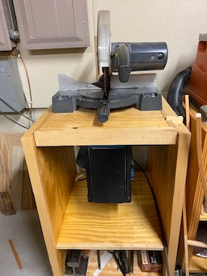
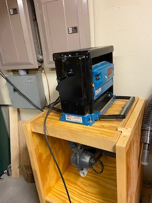

[Link to email lst](./Collateral/email-list.md)

[Link to Letter from Luncheon](./Collateral/JohnBinford-1.md)

#  AppleWood Pointe Hobby Shop
## This repository is a simple place to share ideas and pictures in order to prepare our hobby shop at AWP.
### Questions, Ideas, and Contributions can be sent to johnathan.binford@gmail.com .
**(Alternately,  estrandjord@gmail.com works too! )**

- Interim Moderator Eric S. will gather pictures and information, and then post it all here for easy viewing.
- A folder will be created for each resident, and a master page will showplace various tools and ideas.
- The table above shows recent activity, you can click the folders or activity to see the information.
- Verbiage next to each folder indicates the most recent activity for that folder.
### Use the email list to create email threads for general discussions.  
[Click here for the Email List](./Collateral/email-list.md)
* * *
##  Suggestions for your own submissions and optional information for your personal profile.
#### At least!    Pictures and descriptive information about tools you might donate.
- Suggestions for Shop.
- Pictures of noteworthy tools, or any you might wish to be in the shop.
#### Information for your own personal profile. (If you wish  - See the link to Eric-S)
- A picture of you, or a well known avator for workmanship.
- Some background information. 
  - Career milstones and interests.
  - Interests, Hobbies, Skills, etc.
  - Potential things to learn.

**  Send via email to Johnathan.binford@gmail.com
* * * 
### Some Pictures from the Eden Prarie Shop!
- There is plumbing in place for a vent and some other service, and a "vault" near the door.
  - To-do number 1 is to get a list of what's provided.  (Not much it seems :-)  )
*(Click a Picture for a High Definition Version!)*
<table>
  <tr>
    <th>From the Door</th>
     <th>From the Center</th>
     <th>From the Back Corner</th>
  </tr>
  <tr>
    <td valign="top">
    
      </td>
    <td valign="top">
      
      </td>
    <td <valign="top">
      
      </td>
  </tr>
 </table>

<table>
  <tr>
    <td>Other Way from Center</td>
     <td>A Nice Table Saw</td>
     <td>A Bandsaw</td>
  </tr>
  <tr>
    <td valign="top">
      
    </td>
    <td valign="top">
      
    </td>
    <td valign="top">
      
    </td>
  </tr>
 </table>
- I noted a nice air compressor in the "vault" near the door.  (There is a hose reel on the ceiling.)

* * *
* * *

### Recent Submissions from Residents!
*(Click a Pictiure for a High Definition Version!)* 

#### John-W's Submissions
[Link to Jim's Pictures](./Jim-W/readme.md)

<table>
  <tr>
    <th>Air Filter 1</td>
    <th>Dust Collector 1</td>
    <th>Dust Collector 2</td>
  </tr>
  <tr>
      <td valign="top">
      
      </td>
      <td valign="top">
      
      </td>
      <td valign="top">
      
      </td>
  </tr>
 </table>

<table>
  <tr>
    <th>Air Filter 2</td>
    <th>Miter</td>
    <th>Oscillating Sander</td>
  </tr>
  <tr>
 <td valign="top">
      
      </td>      
      <td valign="top">
      
      </td>
      <td valign="top">
      
      </td>
  </tr>
 </table>

 <table>
  <tr>
    <th>Router Table</td>
    <th>Planer</td>
    <th>Radial Arm Saw</td>
  </tr>
  <tr>
      <td valign="top">
      
      </td>
      <td valign="top">
      
      </td>
      <td valign="top">
      
      </td>
  </tr>
 </table>

 #### Jim also has a large collection of power hand tools! 

<pre>

</pre>
**Two Sample Tool Submissions from Eric S**

[Link to Eric's Profile](./Eric-S/readme.md)
<table>
  <tr>
    <td>Rigid Drill Press</td>
     <td>14" Delta Bandsaw</td>
    <td>Other Tools</td>
  </tr>
  <tr>
      <td valign="top">
      
      </td>
      <td valign="top">
      
      </td>
      <td valign="top">
       - Porter Cable Circular Saw (New)  
       - Two Metal Tool Cabinets (Drawers)  
       - Various Mechanic's Tools  
       - Cheap Square Pad Sander 
       - Hitachi 18" Belt Sander with Bench Mount  
       - (Pictures comming - link will be here!)
      </td>
  </tr>
 </table>

