# Applewood Pointe Workshop

## Welcome to the Applewood Pointe Workshop Special Interest Group "Blog"!

***
### Recent News!

An Open House for the Workshop recently occurred. 
-  A short presentation was made by John Binford's proxy Eric outlining a few simple points about the shop before tours of the workshop began.
   -  Our worker bee busybodies were introduced.  We refer to that group as "The Gnag of Four".   
   Hopefullyl we all know Linelle, Jack, Ralph, and Eric (AKA John Binford.)
   -  Help is gladly available for any project - simple to complex -, contact the Gang members to get started.
   -  Mentoring is also availible.
   -  Safety best practices were discussed.  (You are your own keeper!)
   -  Since many at the Great Room gthering were unfamiliar with our SIG's history, we briefly outlined some of the work that was done to get our fine shop in order.
   -  We still maintain a Shop email list.  In the spirit of privacy, contact the gang for a copy.
   -  Our Co-op oriented goals for the shop were outlined...
      -  Available to all.
      -  Fun to use.
      -  Functional for the Pro's, with good facilities and useful tools for beginners.
      -  Well equipped!
      -  Safe.
   -  Our draft Shop User's Manual and other documentation are available from this website.  Along with drawings and other generally useful information.
   -  We stessed safety, and limitations of use in the spirit of safety.
   -  Jack talked a bit about the deatils of running a safe shop.  (Training available and sometimes required.)
   -  Ralph covered some operational tidbits like funding (None - just donations -- we have a box!).
   -  We adjourned and went downstairs, where Ralph, Linelle, and Jack showed things off and had nice chats with various members.
 
To get a copy of the Open House Powerpoint, pelaes email John Binford as below.  
 <a href="mailto:johnathan.binford@gmail.com">  JohnBinford@gmail.com </a>  
(Not kept on this website to preserve security and privacy.)

***

### Sorta New News!
-  An air filtration system, a ceiling mounted power cord reel, and two new cabinets (with lights!) were recently installed.
   -  These are the last chores the volunteer group has planned.
   -  We still need to cull a few redundant tools and sort things a bit but chores are done for now.
 
***     

#### Recent Shop Pictures
-  As usual, Click the pictures to see an HD version.
-  Use your browsers "Back Arrow" to return to the main page (here)!
<table>
<tr>
<td valign="top">
<a href="./Collateral/Final/Back-Row-2Sink.jpg">
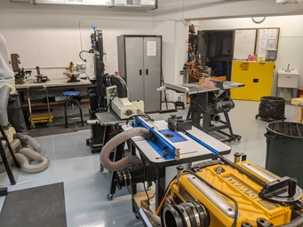
</a>
</td>
<td valign="top">
<a href="./Collateral/Final/Back-Row.jpg">
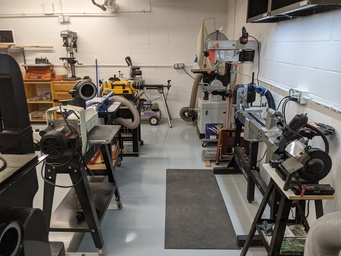
</a>
</td>
<td valign="top">
<a href="./Collateral/Final/Cab-Drills.jpg">
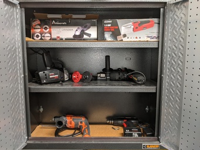
</a>
</td>
</tr>
<tr>

<td valign="top">
<a href="./Collateral/Final/Cab-Routers.jpg">
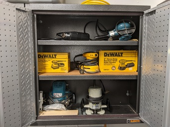
</a>
</td>
<td valign="top">
<a href="./Collateral/Final/Cab-Sanders.jpg">
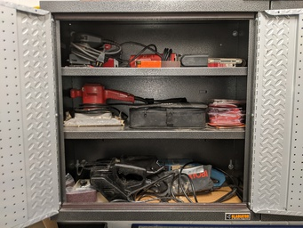
</a>
</td>
<td valign="top">
<a href="./Collateral/Final/Cab-Saws.jpg">
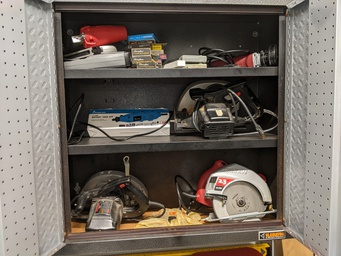
</a>
</td>
</tr>
<tr>
<td valign="top">
<a href="./Collateral/Final/Filter-Cord.jpg">
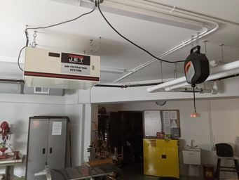
</a>
</td>
<td valign="top">
<a href="./Collateral/Final/Left-Corner.jpg">
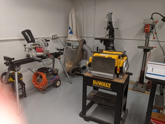
</a>
</td>
<td valign="top">
<a href="./Collateral/Final/To-Jack.jpg">
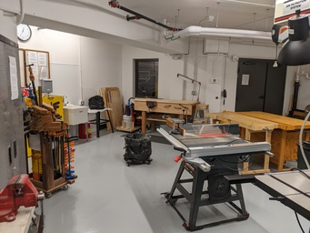
</a>
</tr>
<tr>
<td valign="top">
<a href="./Collateral/Final/Tool-Bench.jpg">
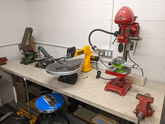
</a>
</td>
</tr>
<tr>
</td>
<td valign="top">
<a href="./Collateral/Final/Clamps-V.jpg">
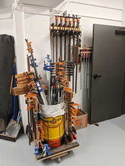
</a>
</td>
<td valign="top">
<a href="./Collateral/Final/Shelf-2-V.jpg">
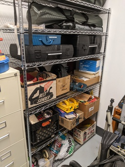
</a>
</td>
<td valign="top">
<a href="./Collateral/Final/Shelf-1-V.jpg">
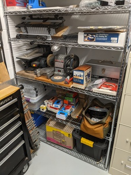
</a>
</td>
</tr>
<tr><td valign="top">
<a href="./Collateral/Final/Cab-Lathe.jpg">
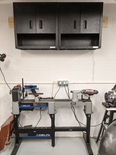
</a>
</td></tr>  
<table>

***
***
   
### Four Months Old News!
-  The shop is ready for duty!
-  Johnathan Binford's alter ego - Eric S - is working on documentation for TV and Internet.
   -  [Click here to see a draft.](./Collateral/Tech/readme.md)
-  The "Gang of Four" is getting ready to mount an air filter to the ceiling  (The last tast on our list!)

***

### Pretty Old News!

-  Jim W. and Larry C. recently moved in, and donated some nice additions to our shop.
   -  We now have everything that was offered by our group over the last year or so.  
   and more!
   - Various benefactors have donated a lot of additional items over the last two months.   Thanks to all!
-  The workshop is readier for duty!
   -  The "Gang of Four" helped Jim move and assemble his nice workbench  
 and then shuffled a few things to place it in a good postion for work.
   -  Special thanks to Ralph L. for his considerable time in getting the finer points of organizing done!
-  The only chores remaining are to mount the two air filters to the ceiling.
   -  Ralph  purchased some "J Hook" anchor bolts that look to be great for the job.
   -  Matt is helping us to be sure that any drilling we do won't harm the building  
   Once we get his OK, we will proceed.  
-  Please contact Johnathan.binford @ gmail.com for training on the big dangerous (for the untrained) stuff
-  [Link to somer older shop photos.](./Collateral/NewPics/Shop-Tools.md)

* * *

 ### Let John Binford know if you have any ideas for making our nice workshop welcoming, useful, and safe? 
-  *Guidelines for happy cooperative-style sharing...*
   -  Connect a dust collector to the machines that have an outlet.
   -  Please sweep up your dust otherwise.
   -  Clean up your own mess, and any other you might find if you can.
   -  Use the sign-out sheet (above the yellow cabinet) to borrow tools.

* * *
* * *

### REALLY OLD but still pertinent News
- Our provisional leaders (Eric, Linelle, Jack, and Ralph) met with Sara to talk about the workshop.
  - Sara is anxious to work with our group and we all beleive that she has a positive effect on our co-op.  And carries her constructive attitude to the shop too!
  - We established that while nearly everyone will have access to the shop, there are some considerations that must be addressed.
    - Our nice new shop has some (Big - Dangerous) power tools that require experience, training, or both.
  - Please be careful when visiting our nice shop.  
    - We nearly finished organizing tools, furniture, and other items.
    - We have to purchase a few safety related items.  (For example, a fireproof oily rag container.)
    - We might have finished a bit of contruction associated with our new dust collection systems. (See our nice present below!)
      - Some members have donated profesional-grade cabinets and shelving, some of which required hanging on the walls. 
- With Sara's support, our group leaders and known members have established guidelines and practices that will keep our shop safe and useful.
    - To that end, we will try to follow the updated preliminary Shop Manual that some of our leaders provided last year.
    - That manual (with input from all, and revisions) will eventually become the co-op's official Shop Manual.
    - The provisional manual is on this website - [Link to the PDF Documents Collection.](./Documents/Download.md)
    - The gang has talked about ventilation and painting.
      - There was discussion about Spray painting (hard to cope with), and brush painting.
      - The group decided to stick with brush painting only - for now.  A spray booth, filtration, and other items are required by various entities. 
- Weis gave our shop a nice present!
  -  Sarah kindly reminded me to look into the shop storage room.
     -  Inside was a brand new Delta dust collection system.
     -  Along with a similar unit (donated), and some dust filters - we should have good air!  
     

* * *

####  Really Old Shop-Pictures

<table>
   <tr>
       <td valign="top">
       
       </td>
       <td valign="top">
       
       </td>
       <td valign="top">
       
       </td>
   </tr>
   <tr>
       <td valign="top">
       
       </td>
       <td valign="top">
       
       </td>
       <td valign="top">
       
       </td>
   </tr>
   </table>

* * *
* * *

### A picture and a bit of information about our CraftsPersons could help us get to know each other!
-  We have a page for workshop users!
-  [Link to the Profile Page!](./Collateral/Profiles.md)

#### Suggested information for your personal profile.
- See [Link to Eric's Profile](./CraftsMen/Eric-S/Profile.md) for examples.
- A picture of you, or a well known avatar for workmanship.
- Some background information. 
  - Career milstones and interests.
  - Interests, Hobbies, Skills, etc.
  - Potential things to learn.
-  If you wish, Please send an email with any information you migh wish to share to our fictional master leader - johnathan.binford@gmail.com
   - Eric  S. (Unit 309) is our temporary webmaster, temporiarily John Binford, and one of the 4 provisional leaders.
     -  The other provisional busybodies are Linell J., Jack W.  and Ralph L.  
-  We respect Internet privacy, so please email John Binford (above) for these three guys' emails.
   - We won't publish the list online.  (Just in case the google robot might find it.)  
-  You can also email John to get our entire mailing list!
  
  * * * 
  * * * 
  
## Our provisional leaders (busybodies) maintain that confidentially kept list of about 33 co-op members.
- This 33 have expressed interest since last year.
  - We'd love to add your name if you are new to the shop.
- Please email johnathan.binford@gmail.com for a copy of the list or for updates.

* * *
* * * 

### Review
## Our Provisional Applewood Pointe of Apple Valley Workshop Manual is Complete! 
1. Initially, until ownership transfers to the resident Board of Directors (see item 3),  
we must abide by the builder provided Applewood Point of Apple Valley's single page SHOP SAFETY RULES (IF they provided one).
2. No other Workshop policies or manuals may be used until handover. 
3. Once the resident Board of Directors has been established, 
our group's more comprehensive Workshop Users Manual may be adopted.
  - Compiled with input from us Workshop Users, we believe this more comprehensive Workshop Users Manual - developed based upon our needs, concerns, and recommendations better meets our Workshop User needs. This draft, to be revisited for final review when the above takes place, will be kept held on our Workshop Website:  www.github.com/johnbinford/Applewood-Pointe 

- [Link to the PDF Documents Collection.](./Documents/Download.md)
  - (Some browsers might then show a "spinning" icon - if yours does,  just click the download button on the right.)
 
### Links
- The "Back" button on your browser is the best wasy to backup from links (Throughout this Repository).

[Link to Eric's Letter from the first luncheon.](./Collateral/JohnBinford-1.md)

[Link to Schematic of Garage.](./Collateral/Garage-H.jpg)

[Link to new Dimensioned Drawing of Shop.](./Collateral/Shop-11-06-22.jpg)

[Link to new Simplified Drawing of Shop.](./Collateral/Plans/Shop.JPG)

[Link to Apple Valley Planning Document.](https://documents.applevalleymn.gov/WebLink/DocView.aspx?id=512623&dbid=0&repo=lf-city)

[Link to Pictures from the Maple Grove Shop.](./Other-Shops/Maple-Grove/readme.md)

[Link to Pictures from the Eagan Shop.](./Other-Shops/Eagan/readme.md)

[Link to Pictures from the Eden Prarie Shop.](./Other-Shops/Eden-Prarie/readme.md)

[Link to Pictures from the GreenHouse Shop.](./Other-Shops/GreenHouse/readme.md)

[Link to Pictures from the Valley West and Southtown Shops](./Other-Shops/Valley-South/readme.md) 

[Link to a Sample Online Manual.](./Documents/Manual.md) 

[Link to a Sample Online Waiver.](./Documents/Waiver.md)
    
[Link to the PDF Documents Collection.](./Documents/Download.md)

[Link to Aerial View (Drawing).](./Collateral/Aerial-1.png) 

[Link to Topographical View (Drawing).](./Collateral/Aerial-Topo.png) 

[Link to Building Elevations (Drawing).](./Collateral/Building-Elevations.png) 
    
[Link to picture of shop's block wall installation.](https://github.com/JohnBinford/AppleWood-Pointe/blob/main/readme.md#heres-a-picture-of-the-blockwork-that-has-been-done-for-the-shop) 
 
* * * 

#### About John Binford
- Note about the use of "John Binford" for this website and email.
  - An imaginary contact is "portable" in case someone else wishes to take over,
    - Eric-S can simply give the password to the new person, and it's done.
    - John Binford also manages this website.
    - If Eric's personal email was used,  a whole new user would be required.
    - It helps us maintain Internet privacy by not publishing anyone's real personal email address.
    - https://www.facebook.com/people/Binford-Tools/100057303114446/
  - John Binford is the collective Nom De Plume for three or four individuals that are authoring content for these pages.  Eric-S just types a lot.
 
