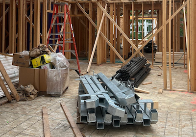
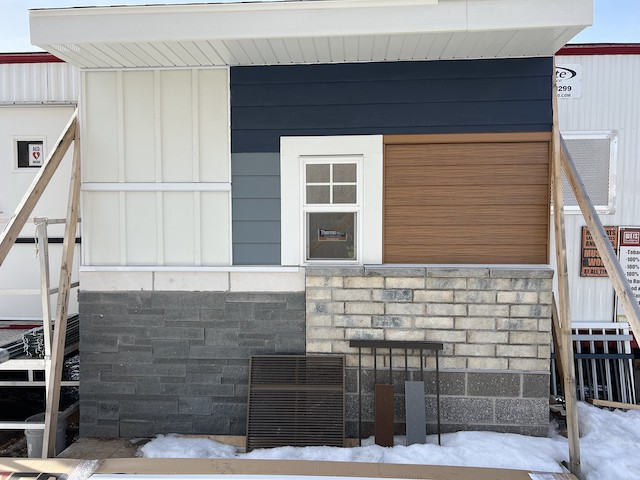
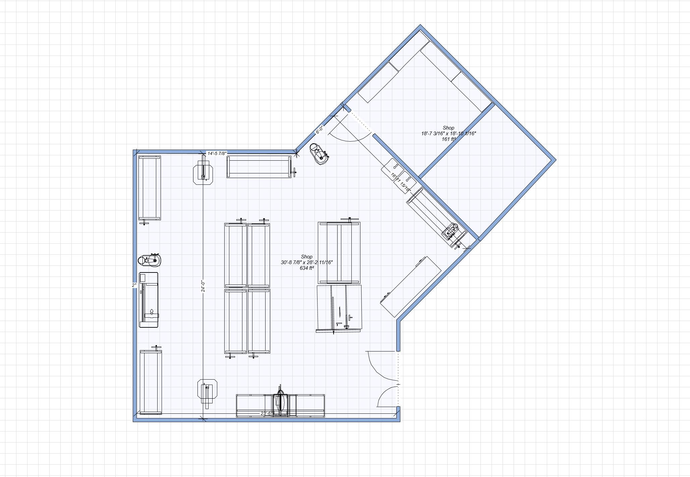
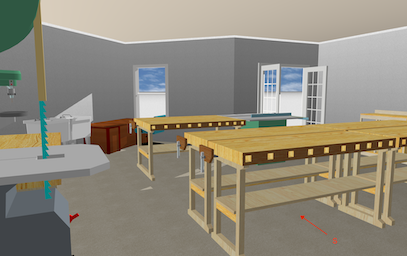
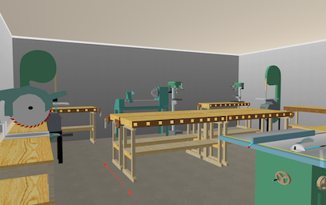
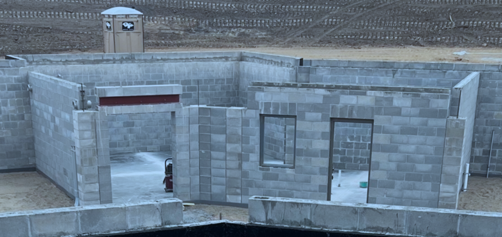
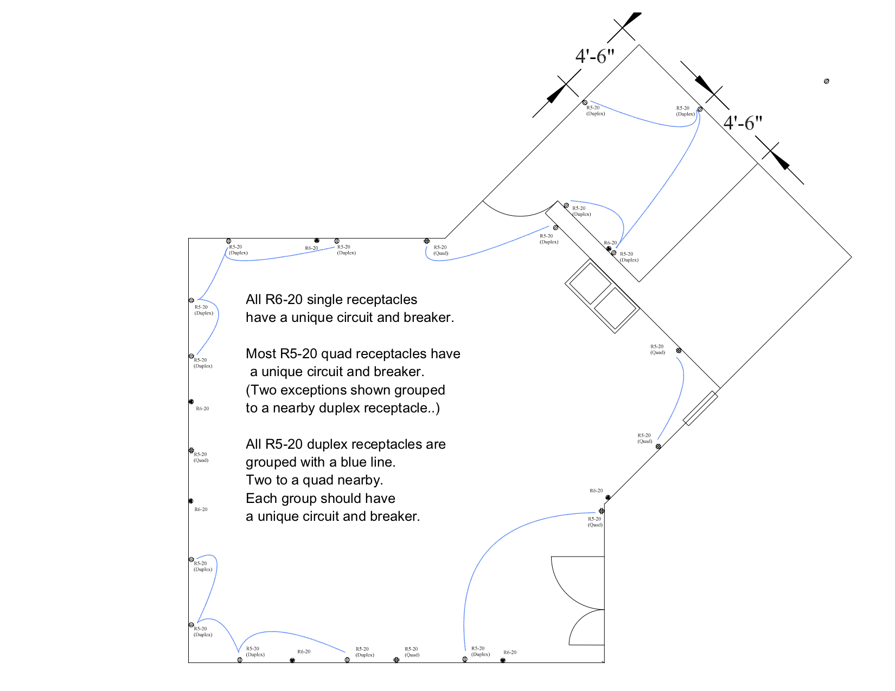

# Applewood Pointe Workshop

## Welcome to the Applewood Pointe Workshop Special Interest Group!

## This repository is our place to share ideas and pictures in order to prepare  and utilize our workshop at AWP.
- (This website was originally used used to facilitate selection of the best of the large shop tools many of us might donate.
  - (We don't need 6 band saws, for example.  So how do we gracefully choose a couple?))  

* * *
* * *

## Questions, Ideas, and Website Contributions can be sent to johnathan.binford@gmail.com .
- Interim Moderator Eric S. will gather pictures and information, and then post it all here for easy viewing.

* * *

 
 

##  We would love to have some information about you and your interests so that we might get to know each other.
###  Suggestions for information for your personal profile.
- Pictures and descriptive information about tools you might donate.
- Suggestions for Shop.
#### Information for your own personal profile. See [Link to Eric's Profile](../CraftsMen/Eric-S/Profile.md) for examples.
- A picture of you, or a well known avatar for workmanship.
- Some background information. 
  - Career milstones and interests.
  - Interests, Hobbies, Skills, etc.
  - Potential things to learn.

**  Send via email to our fictional leader - johnathan.binford@gmail.com
-  Eric  S. (Unit 309) is our temporary webmaster and one of our gang of four.
-  He can take your information and comments as well.  - ad0mz@centurylink.net
   -  ("Gang of four" = BusyBodies that got things rolling more than a year ago.)
-  Other provisionary busy bodies are...
   -  Ralph L.
   -  Linelle J.
   -  Jack W
      -  We try to respect Internet privacy, so please email John Binford (above) for these three guys' emails.
      -  You can also email John to get our entire mailing list!

* * * 

#### About John Binford
- Note about the use of "John Binford" for this website and email.
  - An imaginary contact is "portable" in case someone else wishes to take over,
    - Eric-S can simply give the password to the new person, and it's done.
    - John Binford also manages this website.
    - If Eric's personal email was used,  a whole new user would be required.
    - It helps us maintain Internet privacy by not publishing anyone's real personal email address.
    - https://www.facebook.com/people/Binford-Tools/100057303114446/
  - John Binford is the collective Nom De Plume for three or four individuals that are authoring content for these pages.  Eric-S just types a lot.
 
* * *
* * *

### The Workshop Special Interest Group was established for three reasons.
-  To establish a vision of what our workshop might be like.
-  To develop some operating documents to ensure safe use.
-  To help future Workshop Users with large power tools determine what to bring, and what will not be needed.
   - About 20 of us submitted pictures of various large tools.
   - With consent of the entire group, the leadership committee produced a list of tools we all might use,  and those that would be duplicates.
   - A list was proposed, evaulated, codified, and is now published via email to the group and the link below...
     -  Some browsers won't allow direct links to documents - it just appears to "spin".
     -  If so, just download it using the icon on the top right of the linked page.  (An arrow pointing down into a little tray.)
   -  [Link to the PDF Final Large Tool Selections.](./Documents/APAV090523Tools-Equipment-Selected.pdf)  
  
* * *
* * *

## News

-  A new couple Don and Mary Ann Edberg, recently joined the group.

* * *

#### A few of us were curious what the following pipes were for*
  
  - [Click here to get the answer for the mystery.](./Collateral/Pipes.md)

* * *

- To prepair for Phase Two of our Shop Planning,  This website is being updated.
  - Nothing has been deleted.  Old news has it's own page. You can also use the old mainpage if you wish!
  - [Link to the original main page.](./readme-OLD.md)

* *  *

-  Here's a picture of the exterior materials that will be used.  (From Stacy's nice Flikr Collection.)
   - Click the picture for an HD Version!  

* * *

- [Click here to see Old News.](./Collateral/OldNews.md)  (Not Updated)
- [Click here to see the old Main Page with Large Tool Pictures!](./readme-OLD.md)  (Not Updated)

* * *
* * * 
 
## Workshop Email List   ( A confidentially kept list of our CraftMen's email addresses and a bit of other information. )
- Please email johnathan.binford@gmail.com for a copy of the list.
- Thanks to all for keeping our email list up to date.
  - Please email johnathan.binford@gmail.com with any updates. 

* * *
* * * 

  
## Here's what our shop might look like.  (To scale, with scaled objects.)
-  NOTE!  Last Month, we got a better drawing of the shop!  
   - (The door has moved, and the size is 1.5 feet smaller across.  We get storage!!!) 
   - [Link to new Dimensioned Drawing of Shop.](./Collateral/Shop-11-06-22.jpg)
   - [Link to Simplified Drawing of Shop.](./Collateral/Plans/Shop.JPG)
   - If you want a Scaled PDF of the simplified Shop Drawing, see the last entry in the Documents Collection
   - [Link to the PDF Documents Collection.](./Documents/Download.md)

- Here is a new rendering.  Furnishings and tools arbitrarily located for scale only.
     
- Here is a scaled drwing of the shop with example furnishings.
  
  
- John did some practicing with his cumbersome rendering tools, and painted the walls.  He also added a desk and window!
  -  Click on any of these thumbails to see an enlarged view from inside.  
  
  
  

#### Here's a picture of the blockwork that has been done for the shop.
- Click the picture for an HD Version!  

 
 

-  Here is the Electrical drawing recently submitted to the Engineers.
   -  NOTE!  John heard back from the engineer.  He noted that they would not provide such a comprehensive electrical serivce.
      - They only provide the basics. 
      - John guesses that we might have to do this ourselves.    

 
* * *
## Craftmen's Profiles...
-  A picture and a bit of information about our CraftsMen could help us get to know each other!
   -  [Link to the new Profile Page!](./Collateral/Profiles.md)
   
* * *
## Large Tool Offerings...
-  Our group has met, and decided what large tools our members will be bringing to the shop.
   -  (We spent a lot of time and a little effort exchanging ideas, and then voted on which tools CraftsMen should bring to the shop.)
   - (The big heavy stuff requires prior planning, so the owner can either donate, or sell (etc.)  as he plans his move.)
   -  [Link to the Large Tool Submission Page!](./Collateral/Large-Tools.md)
* * *

## The Proposed Applewood Pointe of Apple Valley Workshop Manual is Complete! 
1. Initially, until ownership transfers to the resident Board of Directors (see item 3),  
we must abide by the builder provided Applewood Point of Apple Valley's single page SHOP SAFETY RULES.
2. No other Workshop policies or manuals may be used until handover. 
3. Once the resident Board of Directors has been established, 
our group's more comprehensive Workshop Users Manual may be adopted.
  - Compiled with input from us Workshop Users, we believe this more comprehensive Workshop Users Manual  developed based upon our needs, concerns, and recommendations better meets our Workshop User needs.   This draft, to be revisited for final review when the above takes place,  will be kept held on our Workshop Website:  www.github.com/johnbinford/applewoodpointe 

- [Link to the PDF Documents Collection.](./Documents/Download.md)
  - (Some browsers might then show a "spinning" icon - if yours does,  just click the download button on the right.)

***
  
### Links
- The "Back" button on your browser is the best wasy to backup from links (Throughout this Repository).

[Link to Eric's Letter from the first luncheon.](./Collateral/JohnBinford-1.md)

[Link to Schematic of Garage.](./Collateral/Garage-H.jpg)

[Link to new Dimensioned Drawing of Shop.](./Collateral/Shop-11-06-22.jpg)

[Link to new Simplified Drawing of Shop.](./Collateral/Plans/Shop.JPG)

[Link to Apple Valley Planning Document.](https://documents.applevalleymn.gov/WebLink/DocView.aspx?id=512623&dbid=0&repo=lf-city)

[Link to the WEIS webams - now with TimeLapse!](https://nbphotos.weisbuilders.com/2022projects/221609/)

[Link to Pictures from the Maple Grove Shop.](./Other-Shops/Maple-Grove/readme.md)

[Link to Pictures from the Eagan Shop.](./Other-Shops/Eagan/readme.md)

[Link to Pictures from the Eden Prarie Shop.](./Other-Shops/Eden-Prarie/readme.md)

[Link to Pictures from the GreenHouse Shop.](./Other-Shops/GreenHouse/readme.md)

[Link to Pictures from the Valley West and Southtown Shops](./Other-Shops/Valley-South/readme.md) 

[Link to Online Manual.](./Documents/Manual.md) 

[Link to Online Waiver.](./Documents/Waiver.md)
    
[Link to the PDF Documents Collection.](./Documents/Download.md)

[Link to Aerial View (Drawing).](./Collateral/Aerial-1.png) 

[Link to Topographical View (Drawing).](./Collateral/Aerial-Topo.png) 

[Link to Building Elevations (Drawing).](./Collateral/Building-Elevations.png) 
    
[Link to Stacy's very nice Flickr collection of construction pictures.](https://www.flickr.com/photos/26824342@N00/sets/72177720299873393) 

[Link to picture of shop's block wall installation.](https://github.com/JohnBinford/AppleWood-Pointe/blob/main/readme.md#heres-a-picture-of-the-blockwork-that-has-been-done-for-the-shop) 

[Link to  the (so far) unused online discussion  (Good Examples!...](https://github.com/JohnBinford/AppleWood-Pointe/blob/main/Collateral/Discussion.md)
 

