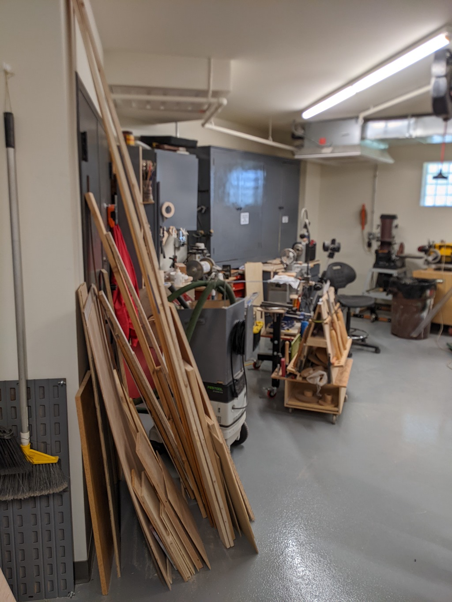
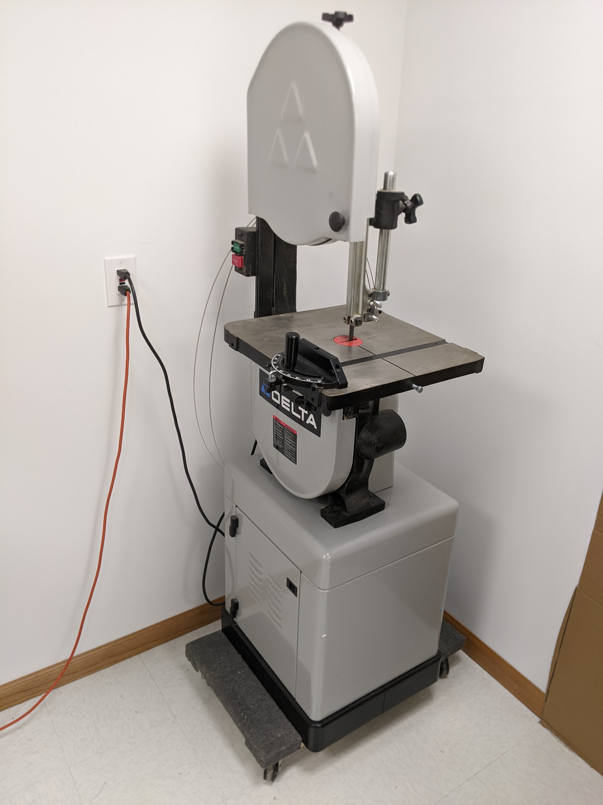
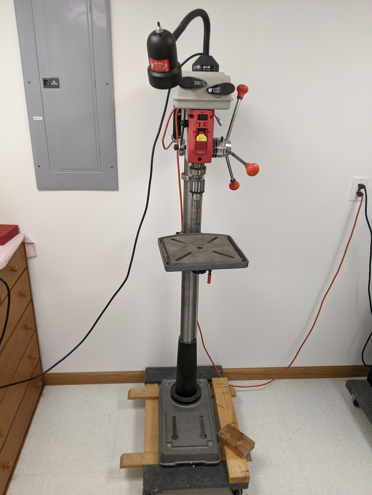

#  Apple Wood Pointe Hobby Shop

## This repository is a simple place to share ideas and pictures in order to prepair our hobbyshop at AWP.

- Interim Moderator Eric S. will gather pictures and information, and then post it all here for easy viewing.
- A folder will be created for each resident, and a master page will showplace various tools and ideas.
- The table above shows recent activity, you can click the folders or activity to see the information.
  - Verbiage next to each folder indicates the most recent activity for that folder.
## Some Pictures from the Eden Prarie Shop!

### Two sample tool submissions from Eric S.

### A Delta 14 inch Bandsaw
#### New tires and blocks

### A Ridgid Drill Press
#### With internal and external lights

