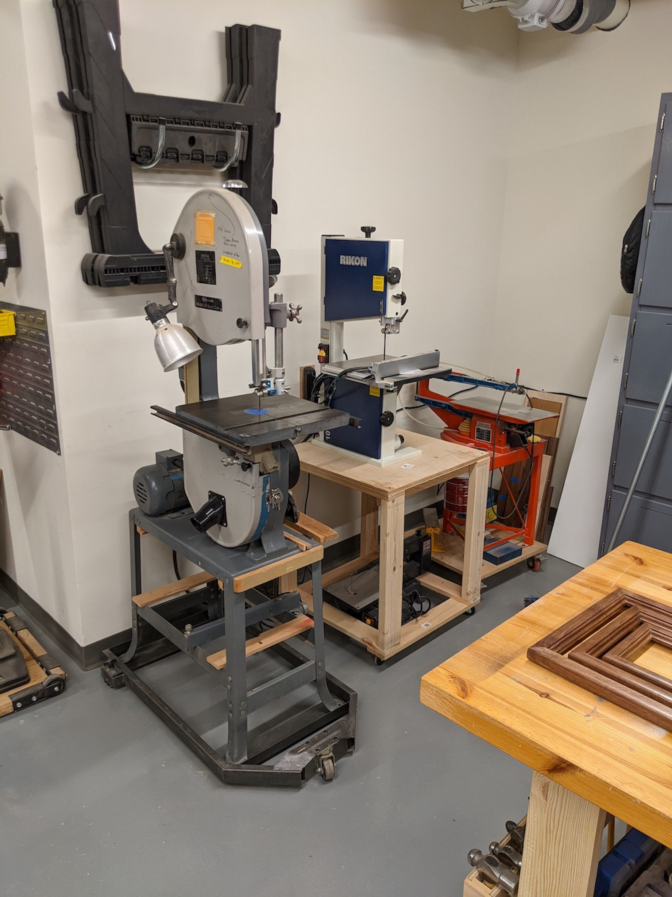

#  Apple Wood Pointe Hobby Shop

## This repository is a simple place to share ideas and pictures in order to prepair our hobbyshop at AWP.

- Interim Moderator Eric S. will gather pictures and information, and then post it all here for easy viewing.
- A folder will be created for each resident, and a master page will showplace various tools and ideas.
- The table above shows recent activity, you can click the folders or activity to see the information.
- Verbiage next to each folder indicates the most recent activity for that folder.
- There is plumbing in place for a vent and some other service, and a "vault" near the door.
  - To-do number 1 is to get a list of what's provided.  (Not much it seems :-)  )

## Some Pictures from the Eden Prarie Shop!

### From the Door. (Is that an exaust system in the background?)

### From the center looking to the door's left.

### From a back corner.

### The other way from the center.

### A nice table saw!

### A nice band saw.  At least one resident has a much newer one almost like it.

- I noted a nice air compressor in the "vault" near the door.  (There is a hose real on teh ceiling.)

## Submissions from residents!

### Two sample tool submissions from Eric S.

### A Delta 14 inch Bandsaw
#### New tires and blocks

### A Ridgid Drill Press
#### With internal and external lights

