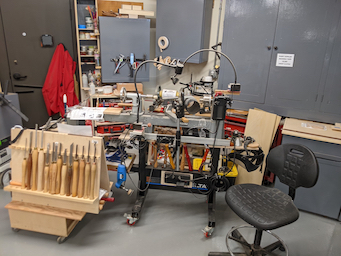
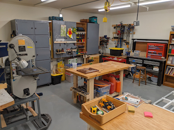
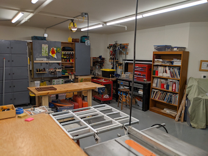
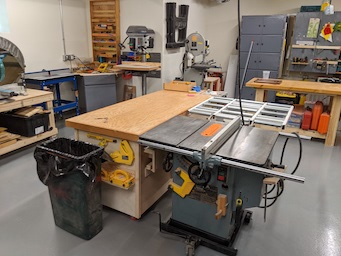
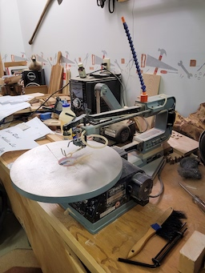

# News
#### Email List
- The list has been updated!  (Two typos, and two new participants.)
- To keep our emails more private, please email johnathan.binford@gmail.com for a copy of the list!
#### Links
[Link to Letter from Luncheon](./Collateral/JohnBinford-1.md)

[Link to Schematic of Garage](./Collateral/AWP-Parking.jpg)

[Link to Dimentioned Drawing (Pretty Close)](./Collateral/AWP-Shop-Dimentioned.JPG)

[Link to Apple Valley Planning Document](https://documents.applevalleymn.gov/WebLink/DocView.aspx?id=512623&dbid=0&repo=lf-city)
#### Recent updates to this website.
  - Linelle-J submitted 10 nice tools!
  - Ralph-L submitted a few nice tools!
  - Eventually, to keep the main page fresh and simple, older offerings will be moved to "CraftsMen" as new offerings come in.
  - You can find older offerings by clicking the "CraftsMen" folder (above) and then their name.

* * *

#  AppleWood Pointe Hobby Shop
## This repository is a simple place to share ideas and pictures in order to prepare our hobby shop at AWP.
### Questions, Ideas, and Contributions can be sent to johnathan.binford@gmail.com .
- Interim Moderator Eric S. will gather pictures and information, and then post it all here for easy viewing.
- A folder will be created for each resident, and a master page will showplace various tools and ideas.
- The table above shows recent activity, you can click the folders or activity to see the information.
- Verbiage next to each folder indicates the most recent activity for that folder.
### Use the email list to create email threads for general discussions. 

* * *
##  Suggestions for your own submissions and optional information for your personal profile.
#### At least!    
- Pictures and descriptive information about tools you might donate.
- Suggestions for Shop.
- Pictures of noteworthy tools, or any you might wish to be in the shop.
#### Information for your own personal profile. (If you wish  - See the link to Eric-S)
- A picture of you, or a well known avator for workmanship.
- Some background information. 
  - Career milstones and interests.
  - Interests, Hobbies, Skills, etc.
  - Potential things to learn.

**  Send via email to johnathan.binford@gmail.com

* * *

### Some Pictures from the Eden Prarie Shop!
- There is plumbing in place for a vent and some other service, and a "vault" near the door.
  - To-do number 1 is to get a list of what's provided.  (Not much it seems :-)  )
*(Click a Picture for a High Definition Version!)*
<table>
  <tr>
    <th>From the Door</th>
     <th>From the Center</th>
     <th>From the Back Corner</th>
  </tr>
  <tr>
    <td valign="top">
    
      </td>
    <td valign="top">
      
      </td>
    <td <valign="top">
      
      </td>
  </tr>
 </table>

<table>
  <tr>
    <td>Other Way from Center</td>
     <td>A Nice Table Saw</td>
     <td>A Bandsaw</td>
  </tr>
  <tr>
    <td valign="top">
      
    </td>
    <td valign="top">
      
    </td>
    <td valign="top">
      
    </td>
  </tr>
 </table>
- I noted a nice air compressor in the "vault" near the door.  (There is a hose reel on the ceiling.)

* * *
* * *

## Recent Submissions from Residents!
*(Click a Pictiure for a High Definition Version!)* 

#### Linelle-J's Submissions

<table>
  <tr>
    <th>Band-Saw</td>
    <th>Belt-Sander</td>
    <th>Drill-Press</td>
  </tr>
  <tr>
      <td valign="top">
      
      </td>
      <td valign="top">
      
      </td>
      <td valign="top">
      
      </td>
  </tr>
 </table>

<table>
  <tr>
    <th>Dust-Collector</td>
    <th>Jig-Saw</td>
    <th>Miter-Saw</td>
  </tr>
  <tr>
      <td valign="top">
      
      </td>      
      <td valign="top">
      
      </td>
      <td valign="top">
      
      </td>
  </tr>
 </table>

 <table>
  <tr>
    <th>Planer-1</td>
    <th>Planer-2</td>
    <th>Router-Table</td>
  </tr>
  <tr>
      <td valign="top">
      
      </td>
      <td valign="top">
      
      </td>
      <td valign="top">
      
      </td>
  </tr>
 </table>

<table>
  <tr>
    <th>Table-Saw</td>
  </tr>
  <tr>
      <td valign="top">
      
  </tr>
 </table>

* * *

#### Ralph-L's Submissions
<table>
  <tr>
    <th>Rigid Work Support</td>
    <th>Delta Drill Press</td>
    <th>10" Compound Miter</td>
    <th>10" Ryobi Table Saw</td>   
  </tr>
  <tr>
      <td valign="top">
      
      </td>
        <td valign="top">
      
      </td>
        <td valign="top">
      
      </td>
        <td valign="top">
      
      </td>
  </tr>
 </table>
 
- Click thumbnails for Hi Def Pictures)
- 
  #### Some other tools...
- 7 1/4" Circular Saw (Rockwell)
- 4.5 Amp Variable Speed Jigsaw (Black & Decker)
- Cordless Powered Hand Saw (Black & Decker)
- Airgrip Multitaskit Lazer Level (Ryobi)
- 18v 1/2" Cordless Drill/Driver (Master Force)
- 6v 1/2" Cordless Drill (Black & Decker)
- Orbital Sander (Rockwell)
- Woodworking Hand Tools
- 6 Gallon Wet/Dry Shop Vacuum (Genie Jet Vac)
- St. Paul Technical College Cabinetmaking Hand Tools & Manuals (my son has Diploma in Cabinetmaking

* * *

#### Jim-W's Submissions
[Link to Jim's Pictures (Duplicates of those below)](./Jim-W/readme.md)

<table>
  <tr>
    <th>Air Filter 1</td>
    <th>Dust Collector 1</td>
    <th>Dust Collector 2</td>
  </tr>
  <tr>
      <td valign="top">
      
      </td>
      <td valign="top">
      
      </td>
      <td valign="top">
      
      </td>
  </tr>
 </table>

<table>
  <tr>
    <th>Air Filter 2</td>
    <th>Miter</td>
    <th>Oscillating Sander</td>
  </tr>
  <tr>
 <td valign="top">
      
      </td>      
      <td valign="top">
      
      </td>
      <td valign="top">
      
      </td>
  </tr>
 </table>

 <table>
  <tr>
    <th>Router Table</td>
    <th>Planer</td>
    <th>Radial Arm Saw</td>
  </tr>
  <tr>
      <td valign="top">
      
      </td>
      <td valign="top">
      
      </td>
      <td valign="top">
      
      </td>
  </tr>
 </table>
 
##### Jim has a nice Biscuit Joiner and a Dovetail Jig
##### Jim also has a large collection of power hand tools! 
 

* * *

**Two Sample Tool Submissions from Eric S**

[Link to Eric's Profile](./CraftsMen/Eric-S/readme.md)
<table>
  <tr>
    <td>Rigid Drill Press</td>
     <td>14" Delta Bandsaw</td>
    <td>Other Tools</td>
  </tr>
  <tr>
      <td valign="top">
      
      </td>
      <td valign="top">
      
      </td>
      <td valign="top">
       
      </td>
  </tr>
 </table>
 
 
  #### Some other tools...
       - Porter Cable Circular Saw (New)
       - Two Metal Tool Cabinets (Drawers)
       - Lots of Mechanic's Tools
       - Cheap Square Pad Sander
       - Ryobi 18" Belt Sander with Bench Mount
       
       - Click thumbnails for Hi Def Pictures)

