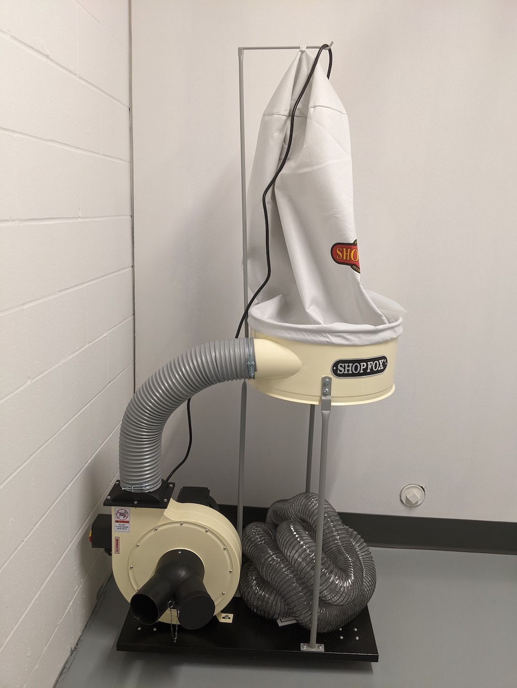
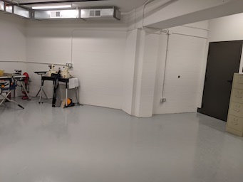
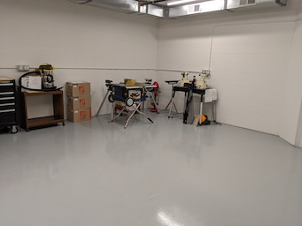
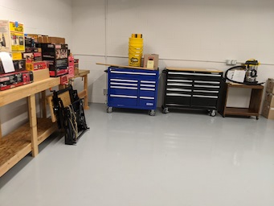
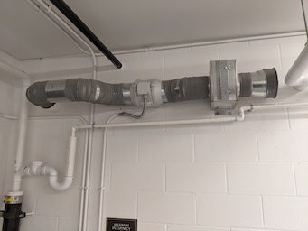
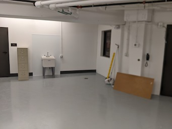
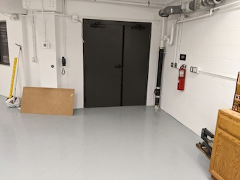

# Applewood Pointe Workshop

## Welcome to the Applewood Pointe Workshop Special Interest Group!

## This repository is our place to share ideas and pictures in order to prepare  and utilize our workshop at AWP.
- (This website was originally created in 2022 to facilitate selection of the best of the large shop tools many of us might donate.
  - (We don't need 6 band saws, for example.  So how do we gracefully choose a couple?)  Many large tools require special shipping and planning.
  - This task is done, and tools are starting to appear in the shop.
* * *
* * *
### News
- Our provisional leaders (Eric, Linelle, Jack, and Ralph) met with Sara to talk about the workshop.
  - Sara is anxious to work with our group and we all beleive that she will have a positive effect on our co-op and will carry her constructive attitude to the shop too!
  - We established that while everyone should have access to the shop, there are some considerations that must be addressed.
    - Our nice shop will have some really nice (Big - Dangerous) power tools that require experience, training, or both.
- With Sara's support, our group leaders and current members will estalish guidlines and practices that will keep our shop safe and useful.
    - To that end, we will try to follow the preliminary Shop Manual that some of our leaders provided last year.
    - That manual (with input from all, and revisions) will eventually become the co-op's official Shop Manual.
    - The provisional manual is on this website - [Link to the PDF Documents Collection.](./Documents/Download.md)
    - The gang also talked about ventilation and painting.
      - There was discussion about Spray painting (hard to cope with), and brush painting.
      - The group decided to stick with brush painting only - for now.  A spray booth, filtration, and other items are required by various entities. 
- Weis gave our shop a nice present!
  -  Sara kindly reminded me to look into the shop storage room.
     -  Inside was a brand bew Delta dust collection system.
     -  Along with a similar unit (dontated), and some dust filters - we should have good air!  
     

* * *

- John finally closed on his unit, so was able to do more than peek through the windows.
- Here are a few pictures.
- Seems like we will need a key to the storage area!
- Bonus,  it's ventilated, so with a bit of filtering we should be able to deal with fumes.
  - John has not yeat traced where the outlet is...

####  Recent Shop-Pictures

<table>
   <tr>
       <td valign="top">
       
       </td>
       <td valign="top">
       
       </td>
       <td valign="top">
       
       </td>
   </tr>
   <tr>
       <td valign="top">
       
       </td>
       <td valign="top">
       
       </td>
       <td valign="top">
       
       </td>
   </tr>
   </table>

* * *
* * *

## A picture and a bit of information about our CraftsMen could help us get to know each other!
-  We have a page for workshop users!
-  [Link to the Profile Page!](./Collateral/Profiles.md)

###  Suggested information for your personal profile.
- See [Link to Eric's Profile](./CraftsMen/Eric-S/Profile.md) for examples.
- A picture of you, or a well known avatar for workmanship.
- Some background information. 
  - Career milstones and interests.
  - Interests, Hobbies, Skills, etc.
  - Potential things to learn.
-  Send via email to our fictional leader - johnathan.binford@gmail.com
   - Eric  S. (Unit 309) is our temporary webmaster and one of the 4 provisional leaders.
     -  The other provisional busybodies are Linell J., Jack W.  and Ralph L.  
-  We try to respect Internet privacy, so please email John Binford (above) for these three guys' emails.
-  You can also email John to get our entire mailing list!
  
  * * * 
  * * * 
  
## Our provisional leaders (busybodies) maintain a onfidentially kept list of about 33 co-op members.
- This 33 have expressed interest since last year.
  - We'd love to add your name if you are new to the shop.
- Please email johnathan.binford@gmail.com for a copy of the list.
  - Thanks to all for keeping our email list up to date.
  - Please email johnathan.binford@gmail.com with any updates. 

* * *
* * * 

## Questions, Ideas, and Website Contributions can be sent to johnathan.binford@gmail.com .
- Interim Moderator Eric S. will gather pictures and information, and then post it all here for easy viewing.
   - Pictures and descriptive information about tools you might donate.
   - Suggestions for Shop.

* * *
* * *

## Our Provisional Applewood Pointe of Apple Valley Workshop Manual is Complete! 
1. Initially, until ownership transfers to the resident Board of Directors (see item 3),  
we must abide by the builder provided Applewood Point of Apple Valley's single page SHOP SAFETY RULES.
2. No other Workshop policies or manuals may be used until handover. 
3. Once the resident Board of Directors has been established, 
our group's more comprehensive Workshop Users Manual may be adopted.
  - Compiled with input from us Workshop Users, we believe this more comprehensive Workshop Users Manual - developed based upon our needs, concerns, and recommendations better meets our Workshop User needs. This draft, to be revisited for final review when the above takes place, will be kept held on our Workshop Website:  www.github.com/johnbinford/Applewood-Pointe 

- [Link to the PDF Documents Collection.](./Documents/Download.md)
  - (Some browsers might then show a "spinning" icon - if yours does,  just click the download button on the right.)

***
  
### Links
- The "Back" button on your browser is the best wasy to backup from links (Throughout this Repository).

[Link to Eric's Letter from the first luncheon.](./Collateral/JohnBinford-1.md)

[Link to Schematic of Garage.](./Collateral/Garage-H.jpg)

[Link to new Dimensioned Drawing of Shop.](./Collateral/Shop-11-06-22.jpg)

[Link to new Simplified Drawing of Shop.](./Collateral/Plans/Shop.JPG)

[Link to Apple Valley Planning Document.](https://documents.applevalleymn.gov/WebLink/DocView.aspx?id=512623&dbid=0&repo=lf-city)

[Link to the WEIS webams - now with TimeLapse!](https://nbphotos.weisbuilders.com/2022projects/221609/)

[Link to Pictures from the Maple Grove Shop.](./Other-Shops/Maple-Grove/readme.md)

[Link to Pictures from the Eagan Shop.](./Other-Shops/Eagan/readme.md)

[Link to Pictures from the Eden Prarie Shop.](./Other-Shops/Eden-Prarie/readme.md)

[Link to Pictures from the GreenHouse Shop.](./Other-Shops/GreenHouse/readme.md)

[Link to Pictures from the Valley West and Southtown Shops](./Other-Shops/Valley-South/readme.md) 

[Link to Online Manual.](./Documents/Manual.md) 

[Link to Online Waiver.](./Documents/Waiver.md)
    
[Link to the PDF Documents Collection.](./Documents/Download.md)

[Link to Aerial View (Drawing).](./Collateral/Aerial-1.png) 

[Link to Topographical View (Drawing).](./Collateral/Aerial-Topo.png) 

[Link to Building Elevations (Drawing).](./Collateral/Building-Elevations.png) 
    
[Link to Stacy's very nice Flickr collection of construction pictures.](https://www.flickr.com/photos/26824342@N00/sets/72177720299873393) 

[Link to picture of shop's block wall installation.](https://github.com/JohnBinford/AppleWood-Pointe/blob/main/readme.md#heres-a-picture-of-the-blockwork-that-has-been-done-for-the-shop) 

[Link to  the (so far) unused online discussion  (Good Examples!...](https://github.com/JohnBinford/AppleWood-Pointe/blob/main/Collateral/Discussion.md)
 
* * * 

#### About John Binford
- Note about the use of "John Binford" for this website and email.
  - An imaginary contact is "portable" in case someone else wishes to take over,
    - Eric-S can simply give the password to the new person, and it's done.
    - John Binford also manages this website.
    - If Eric's personal email was used,  a whole new user would be required.
    - It helps us maintain Internet privacy by not publishing anyone's real personal email address.
    - https://www.facebook.com/people/Binford-Tools/100057303114446/
  - John Binford is the collective Nom De Plume for three or four individuals that are authoring content for these pages.  Eric-S just types a lot.
 
