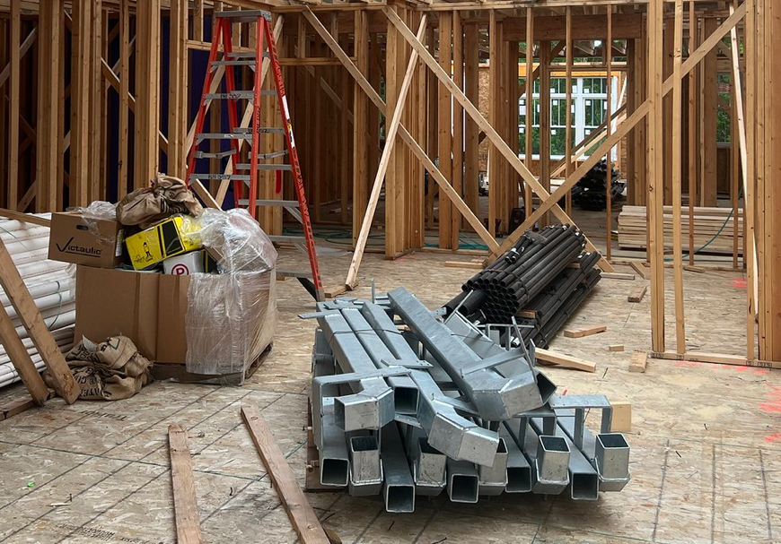
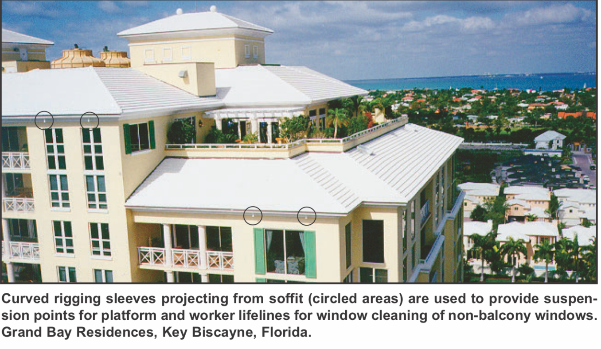
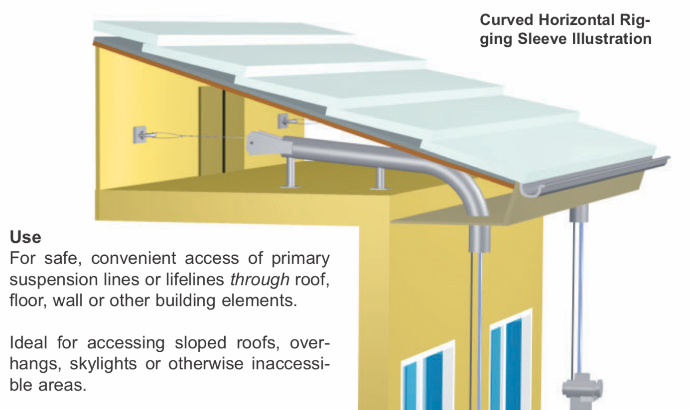

# Applewood Pointe Workshop

#### If you are new the the Apple Valley Workshop Group, or this is your first time here...

- Use the link below to see some introductory information. 
  - [Click here to see the "New Guy" page.](./Collateral/newguy.md)
	
* * *
* * *

## News
###  The "Gang of Four" recently met to finalize a few minor changes to our large tools list.

-  A new guy John Beyer, contacted John Binford and offered a few really nice tools; including a new in the box Miter Saw!
   -  Linelle Johnson was going to bring his, but he has offered to "keep it", and have John bring his nicer saw to the shop.
   -  Linelle will keep his Miter Saw in reserve until we know for sure.
-  There was a bit of disucssion about shop safety.
   - The gang concluded that certain items MUST have certtain guards and other safety attachments - especially on Table Saws.
      -  We decided to check on the current says that we elected, and came up with alternatives if necessary.
      -  Specifically, we noted that the prosumer saw that Lan Copt offered looked to be missing those devices.
      -  Linelle had recently offered a Swiss-built Table saw that has safety and many other jigs and attachments that would be a good alternative.
-  Linelle had also offered a belt sander, but noted that another Craftman offered a better one.
   -  John  will try to locate that item and get it on board
* * * 

### You might remember some email chatter about  the fact that 13 of us met at the Dakota County Library to chat about shop stuff.
	
- The shop website was reviewed as a foundation for various discussions.

- Until that meeting, organizers had concentrated on settling the disposition of large electric shop tools.  (The stuff that’s hard to move without planning…)
  - Letting potential donors know what will be needed and what they might need to otherwise dispose of was the group's primary job.
  - Eric S. produced some lists with pictures of large shop tools the still needed some type of decision.
  - After that constructive discussion, the group unanimously agreed to stand with the recommendation of the Gang of Four - (Busybodies that have been working on shop issues since 2021).

 - A spreadsheet representing the list of what large shop tools various craftsmen should plan to bring to the shop is liniked below.
   - Please check out the list, and plan to bring any items highlighted in green!  Thanks a ton to those that participated.      
     -  A link to the PDF of the Large Tools Selection Spreadsheet lies below.
        -  Some browsers won't allow direct links to documents - it just appears to "spin".
        -  If so, just download it using the icon on tohe top right.  (An arown pointing down into a little tray.) 
     -  [Link to the PDF Final Large Tool Selections.](./Documents/APAV042623Tools-Equipment-Selected.pdf)  
     -  [Link to the pictures of items submitted by various CraftsMen.](./Collateral/Large-Tools.md)
     
## The 13 CraftsMen discussed what to do with smaller power tools and hand tools.
   - A goal is to have a nice collection of "portable" tools that can be "checked out" for use outside of the shop.
   - We settled on using a "common sense" approach.
   - If you have something that's unique, common but new, or potentially popular we encourage donating it to the shop. 
	
* * *
## One of the guys wondered what the strange square metal "pipe" was in the ceiling of a commoon area.
-  John recently spotted this collection of those pipes in Stacy's recent picture upload.
   -  If anyone knows what they might be, please email John.  johnathan.binford@gmail.com  

  
 
-  Here's an earlier picture of one of those heavy looking pipes in the overhead somewhere... 

  
 

- With the help of Doug,  John speculates that these heavy pipes are "guides" to allow for a "rope" to be "dangled" from the eaves of each unit.  (You can see them protruding throiugh the soffits centered on the main window of each unit.)
  - One would go into the attic with a special rope with a small weight and feed it through the end of this pipe from the catwalk that's already up there...
   
- Sometimes the trick to a successful google search is to learn the terminology.
  - I read started with “Rope Descent Equipment” and after about ten steps found the term “Rigging Sleeve”
  - A quick new search found these….  
   
   
 
 - I think those long square tubes are indeed for window washing —  just a home made version of a cmmercial product.

* * *

- To prepair for Phase Two of our Shop Planning,  This website is being updated.
  - Nothing has been deleted.  Old news has it's own page. You can also use the old mainpage if you wish!
  - [Link to the original main page.](./readme-OLD.md)

* *  *

-  Here's a picture of the exterior materials that will be used.  (From Stacy's nice Flikr Collection.)
   - Click the picture for an HD Version!  

* * *

- [Click here to see Old News.](./Collateral/OldNews.md)
- [Click here to see the old Main Page with Large Tool Pictures!](./readme-OLD.md)

* * *
* * * 
 
## Workshop Email List   ( A confidentially kept list of our CraftMen's email addresses and a bit of other information. )
- Please email johnathan.binford@gmail.com for a copy of the list.
- Thanks to all for keeping our email list up to date.
  - Please email johnathan.binford@gmail.com with any updates. 

* * *
* * * 

  
## Here's what our shop might look like.  (To scale, with scaled objects.)
-  NOTE!  Last Month, we got a better drawing of the shop!  
   - (The door has moved, and the size is 1.5 feet smaller across.  We get storage!!!) 
   - [Link to new Dimensioned Drawing of Shop.](./Collateral/Shop-11-06-22.jpg)
   - [Link to Simplified Drawing of Shop.](./Collateral/Plans/Shop.JPG)
   - If you want a Scaled PDF of the simplified Shop Drawing, see the last entry in the Documents Collection
   - [Link to the PDF Documents Collection.](./Documents/Download.md)

- Here is a new rendering.  Furnishings and tools arbitrarily located for scale only.
     
- Here is a scaled drwing of the shop with example furnishings.
  
  
- John did some practicing with his cumbersome rendering tools, and painted the walls.  He also added a desk and window!
  -  Click on any of these thumbails to see an enlarged view from inside.  
  
  
  

#### Here's a picture of the blockwork that has been done for the shop.
- Click the picture for an HD Version!  

 
 

-  Here is the Electrical drawing recently submitted to the Engineers.
   -  NOTE!  John heard back from the engineer.  He noted that they would not provide such a comprehensive electrical serivce.
      - They only provide the basics. 
      - John guesses that we might have to do this ourselves.    

 
* * *
## Craftmen's Profiles...
-  A picture and a bit of information about our CraftsMen could help us get to know each other!
   -  [Link to the new Profile Page!](./Collateral/Profiles.md)
   
* * *
## Large Tool Offerings...
-  Our group has met, and decided what large tools our members will be bringing to the shop.
   -  (We spent a lot of time and a little effort exchanging ideas, and then voted on which tools CraftsMen should bring to the shop.)
   - (The big heavy stuff requires prior planning, so the owner can either donate, or sell (etc.)  as he plans his move.)
   -  [Link to the Large Tool Submission Page!](./Collateral/Large-Tools.md)
* * *

## The Proposed Applewood Pointe of Apple Valley Workshop Manual is Complete! 
1. Initially, until ownership transfers to the resident Board of Directors (see item 3),  
we must abide by the builder provided Applewood Point of Apple Valley's single page SHOP SAFETY RULES.
2. No other Workshop policies or manuals may be used until handover. 
3. Once the resident Board of Directors has been established, 
our group's more comprehensive Workshop Users Manual may be adopted.
  - Compiled with input from us Workshop Users, we believe this more comprehensive Workshop Users Manual  developed based upon our needs, concerns, and recommendations better meets our Workshop User needs.   This draft, to be revisited for final review when the above takes place,  will be kept held on our Workshop Website:  www.github.com/johnbinford/applewoodpointe 

- [Link to the PDF Documents Collection.](./Documents/Download.md)
  - (Some browsers might then show a "spinning" icon - if yours does,  just click the download button on the right.)

***
  
### Links
- The "Back" button on your browser is the best wasy to backup from links (Throughout this Repository).

[Link to Eric's Letter from the first luncheon.](./Collateral/JohnBinford-1.md)

[Link to Schematic of Garage.](./Collateral/Garage-H.jpg)

[Link to new Dimensioned Drawing of Shop.](./Collateral/Shop-11-06-22.jpg)

[Link to new Simplified Drawing of Shop.](./Collateral/Plans/Shop.JPG)

[Link to Apple Valley Planning Document.](https://documents.applevalleymn.gov/WebLink/DocView.aspx?id=512623&dbid=0&repo=lf-city)

[Link to the WEIS webams - now with TimeLapse!](https://nbphotos.weisbuilders.com/2022projects/221609/)

[Link to Pictures from the Maple Grove Shop.](./Other-Shops/Maple-Grove/readme.md)

[Link to Pictures from the Eagan Shop.](./Other-Shops/Eagan/readme.md)

[Link to Pictures from the Eden Prarie Shop.](./Other-Shops/Eden-Prarie/readme.md)

[Link to Pictures from the GreenHouse Shop.](./Other-Shops/GreenHouse/readme.md)

[Link to Pictures from the Valley West and Southtown Shops](./Other-Shops/Valley-South/readme.md) 

[Link to Online Manual.](./Documents/Manual.md) 

[Link to Online Waiver.](./Documents/Waiver.md)
    
[Link to the PDF Documents Collection.](./Documents/Download.md)

[Link to Aerial View (Drawing).](./Collateral/Aerial-1.png) 

[Link to Topographical View (Drawing).](./Collateral/Aerial-Topo.png) 

[Link to Building Elevations (Drawing).](./Collateral/Building-Elevations.png) 
    
[Link to Stacy's very nice Flickr collection of construction pictures.](https://www.flickr.com/photos/26824342@N00/sets/72177720299873393) 

[Link to picture of shop's block wall installation.](https://github.com/JohnBinford/AppleWood-Pointe/blob/main/readme.md#heres-a-picture-of-the-blockwork-that-has-been-done-for-the-shop) 

[Link to  the (so far) unused online discussion  (Good Examples!...](https://github.com/JohnBinford/AppleWood-Pointe/blob/main/Collateral/Discussion.md)
 

