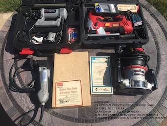
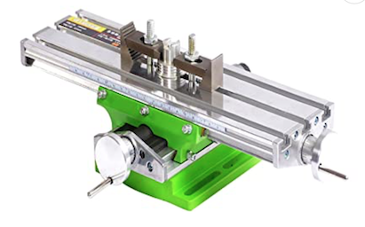
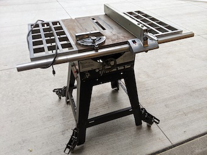

# AppleWood Pointe Workshop 

#### If you are new the the Apple Valley Workshop Group, or this is your first time here...

- Use the link below to see some introductory information. 
[Click here to see the "New Guy" page.](./Collateral/newguy.md) 

***

## Applewood Pointe of Apple Valley Workshop Email List
- The email list is even more up to date! (Thanks to Ralph and others for their suggested corrections!)
  - To keep our emails more private, please email johnathan.binford@gmail.com for a copy of the list!
  
* * *

## News
- Shortcuts to frequently used segments of this page... 
[Shortcut to Things to Think About.](https://github.com/JohnBinford/AppleWood-Pointe/blob/main/readme.md#recent-member-suggestions-and-things-to-think-about) 
[Shortcut to Email List info.](https://github.com/JohnBinford/AppleWood-Pointe/blob/main/readme.md#applewood-pointe-of-apple-valley-workshop-email-list) 
[Shortcut to a Collection of Handy Links.](https://github.com/JohnBinford/AppleWood-Pointe/blob/main/readme.md#links) 
[Shortcut to Craftsmen Submissions and Pictures.](https://github.com/JohnBinford/AppleWood-Pointe/blob/main/readme.md#recent-submissions-from-craftsmen)

### Tool voting being tested, try it if you wish!  (Might not work - still learning...)
  - John B. was fortunate to attend the recent lunch meeting, and promptly gave some thought to facilitating tool voting.  
       - He is investigating the use of an online voting system like "Survey Monkey" or "Google Forms"  for this task. 
  [Click here to preview a test example of a possible way for us to vote up various tools](./Collateral/Selections.md)  
   - (After test period) If you hate computers like John, You can also email johnathan.binford@gmail.com with any votes you wish to cast!
     - John is also investigating a free online chat system we could use. 
     * Given that we don't want "login ID's" to remember, this is will be hard to figure out!

***

## Recent updates to this website

  - Jack-W just sent a few more tool photos.  He's working on a new hand tool workbench! 
  [Link to Jacks's Profile](./CraftsMen/Jack-W/readme.md)

  - Len-C recently sent a few nice tools photos!  
  [Link to Len's Profile](./CraftsMen/Len-C/readme.md)

  - Ralph recently toured the SouthTown and Valley West Shops.  
    [Link to Pictures from those Shops](./Other-Shops/Valley-South/readme.md) 

  - There are questions about whether the builder has moved the entry.  A telephoto lens suggests not!
    - Here are a couple of pictures.  John-B speculates that the apparrent new entry is just protective gravel over the footing for construciton traffic.  See what you think! 
    [Link to aerial of footings.](./Collateral/Footings.jpeg) 
    [Link to telephoto shot of suspected "real" entry in block wall.  As shown in the sales kit.](./Collateral/Garage-Entry.JPG)
    

***

## Recent Member Suggestions and things to think about:
- During the Fall Luncheon, John B. Determined that the ventilation provided will NOT be useful for a paint booth.    (A ton of things change if a "hood" is involved due to code.)  We will need to "build" our own.
  - The storage area next to the shop has HVAC in it, so we can't use it right away.
  - John B. will be talking to Colleen about getting locking receptables on the ceiling for electrical Cable drops.  (Both 110 and 220, Single phase.)  Google "cable drop".
  
- It might be nice for us to know our unit numbers.  Please email if you wish to have yours on the email list.

- AWP won't furnish much for the space.
  - Benches, cabinets, chests, and storage need consideration.
  - [Click here to see Sample accessories.](./Collateral/accessories.md)
  
- Four fellows have been gathering suggestions from other shops and have started other "Deep Thoughts".
  - Electing Tools:  
    - We need to decide how many of each we want.
    - The best doesn't just mean heavy duty permanent placement equipment, but should include best portable equipment (table saws. miter saws, etc.) which can be easily set up when needed, placed where they can best be used with material being cut, and then easily taken down (folded) and be placed out of the way to provide more room in the Shop for other projects to be worked on at the time.
    
  - As yet unconsidered tools:   
    - Lathes, - vices, - panel saw, - metal working machines (milling machine) which no one has submitted so far.
    
  - What will our policies be?
    - Who gets a key?  
      - AWP will  give shop keys to every resident who signs a waiver. Not just wood shop members.  
	  Does this mean that they are O.K. with any resident entering the shop at any time, even if they are alone? 
    - Should we have a Workshop Manual?  One of the guys is working on a sample. 

* * *
  
### Links
- The "Back" button on your browser is the best wasy to backup from links (Throughout this Repository).

[Link to Letter from Luncheon](./Collateral/JohnBinford-1.md)

[Link to Schematic of Garage](./Collateral/Garage-H.jpg)

[Link to Dimentioned Drawing of Shop (Pretty Close)](./Collateral/AWP-Shop-Dimentioned.JPG)

[Link to Apple Valley Planning Document](https://documents.applevalleymn.gov/WebLink/DocView.aspx?id=512623&dbid=0&repo=lf-city)

[Link to the WEIS webams - now with TimeLapse!](https://nbphotos.weisbuilders.com/2022projects/221609/)

[Link to Pictures from the Maple Grove Shop](./Other-Shops/Maple-Grove/readme.md)

[Link to Pictures from the Eagan Shop](./Other-Shops/Eden-Prarie/readme.md)

[Link to Pictures from the Eden Prarie Shop](./Other-Shops/Eden-Prarie/readme.md)

[Link to Pictures from the GreenHouse Shop](./Other-Shops/GreenHouse/readme.md)

[Link to Pictures from the Valley West and Southtown Shops](./Other-Shops/Valley-South/readme.md) 

[Link to Online Manual.](./Documents/Manual.md) 

[Link to Online Waiver.](./Documents/Waiver.md)
    
[Link to the PDF Documents Collection.](./Documents/Download.md)

* * *
* * *

## Recent Submissions from Craftsmen!
*(Click a Pictiure for a High Definition Version!)* 

####  Len C. Recently sent a few pictures.  There was a sanding table of some sort John has not seen!

[Link to Len's Profile](./CraftsMen/Len-C/readme.md) 

<table>
  <tr>
    <th>Delta Band Saw</td>
    <th>Bench Drawers</td>
    <th>Drill Press</td>
  </tr>
  <tr>
      <td valign="top">
      
      </td>
      <td valign="top">
      
      </td>
      <td valign="top">
       
      </td>
  </tr>
 </table>
 
 <table>
   <tr>
     <th>Sanding-Table</td>
     <th>Sorted-Fasteners</td>
     <th>Table-Saw</td>
   </tr>
   <tr>
       <td valign="top">
       
       </td>
       <td valign="top">
       
       </td>
       <td valign="top">
        
       </td>
   </tr>
  </table>
  
 <table>
   <tr>
     <th>WorkBench</td>
   </tr>
   <tr>
       <td valign="top">
       
       </td>
       </tr>
  </table>
 
* * *

 #### Dave-P's Submissions
 [Link to Dave's Profile](./CraftsMen/Dave-P/readme.md)
 
 <table>
  <tr>
    <th>Table Saw</td>
    <th>Band-Saw</td>
    <th>Jointer</td>
  </tr>
  <tr>
      <td valign="top">
      
      </td>
      <td valign="top">
      
      </td>
      <td valign="top">
      
      </td>
  </tr>
 </table>

<table>
  <tr>
    <th>Drill Press</td>
    <th>Dust-Collector</td>
  </tr>
  <tr>
 <td valign="top">
      
      </td>      
      <td valign="top">
      
  </tr>
 </table>
 #### Dave also has a large collection of hand tools and portable power tools! 

 * * *
 
#### Some interesting offerings from Dave Z.
-  Dave has more to come.
-  This picture suggests some tools that we all need to consider!
<table>
  <tr>
    <th>Dave's Assorment of Useful items</td>

  </tr>
  <tr>
      <td valign="top">
      
      </td>
 </table>
 
 * * *
 
#### Jack-W's Submissions

<table>
  <tr>
    <th>Dewalt Planer</td>
    <th>PowerMatic Band Saw</td>
    <th>Some Nice Clamps, etc.</td>
  </tr>
  <tr>
      <td valign="top">
      
      </td>
      <td valign="top">
      
      </td>
      <td valign="top">
      
      </td>
  </tr>
 </table>

<table>
  <tr>
    <th>Dust Collector</td>
    <th>Rikon Wet Sharpener</td>
    <th>Nice Dust Filer</td>
  </tr>
  <tr>
 <td valign="top">
      
      </td>      
      <td valign="top">
      
      </td>
      <td valign="top">
      
      </td>
  </tr>
 </table>

<table>
  <tr>
    <th>Tool Chest</td>
    <th>Work Bench</td>
    <th>Bench Holes</td>
  </tr>
  <tr>
 <td valign="top">
      
      </td>      
      <td valign="top">
      
      </td>
      <td valign="top">
      
      </td>
  </tr>
 </table>

<table>
  <tr>
    <th>Craftsman Tool Chest</td>
    <th>Lumber for NEW Workbench</td>
    <th>Another Nice Tool Chest.</td>
  </tr>
  <tr>
      <td valign="top">
      
      </td>
      <td valign="top">
      
      </td>
      <td valign="top">
      
      </td>
  </tr>
 </table>

 <table>
  <tr>
    <th>Other Tools</td>
    <th>(More Tools)</td>
  </tr>
  <tr>
     	<td valign="top">
	- Milwaukee 4x24 belt sander 
	- Bosch random orbit sander 
	- Makita random orbit sander 
	- Ryobi biscuit joiner 
	- Makita power plane 
      	</td>
      	<td valign="top">
	- Makita water stone power sharpener 
	- Porter Cable detail sander 
	- Porter Cable Brad nailers (2) 
	- Drills and bits. Some Forster, brad point, twist bit, etc 
	- Various other shop items and supplies. 	</td>	
  </tr>
 </table>

* * *

####  Len-B's Offerings

<table>
  <tr>
    <th>Drill Press</td>
    <th>Planer</td>
  </tr>
  <tr>
      <td valign="top">
      
      </td>
      <td valign="top">
      
      </td>
  </tr>
 </table>

<table>
  <tr>
    <th>Router-Jigsaw</td>
    <th>Scrollsaw</td>
  </tr>
  <tr>
      <td valign="top">
       
      </td>
      <td valign="top">
      
      </td>
  </tr>
 </table>
 
* * *

#### Linelle-J's Submissions

<table>
  <tr>
    <th>Band-Saw</td>
    <th>Belt-Sander</td>
    <th>Drill-Press</td>
  </tr>
  <tr>
      <td valign="top">
      
      </td>
      <td valign="top">
      
      </td>
      <td valign="top">
      
      </td>
  </tr>
 </table>

<table>
  <tr>
    <th>Dust-Collector</td>
    <th>Table-Saw</td>
    <th>Miter-Saw</td>
  </tr>
  <tr>
      <td valign="top">
      
      </td>      
      <td valign="top">
      
      </td>
      <td valign="top">
      
      </td>
  </tr>
 </table>

 <table>
  <tr>
    <th>Planer-1</td>
    <th>Planer-2</td>
    <th>Router-Table</td>
  </tr>
  <tr>
      <td valign="top">
      
      </td>
      <td valign="top">
      
      </td>
      <td valign="top">
      
      </td>
  </tr>
 </table>
 
-  Linelle recently added a few more items to his list.  (Unpictured)
   -  36 x 12 Inch Lalthe
   -  17 Inch Drum Sander
   -  Scroll Saw

***

#### Ralph-L's Submissions

[Link to Ralph-L's Profile](./CraftsMen/Ralph-L/readme.md)
<table>
  <tr>
    <th>Rigid Work Support</td>
    <th>Delta Drill Press</td>
    <th>10" Compound Miter</td>
    <th>10" Ryobi Table Saw</td>   
  </tr>
  <tr>
      <td valign="top">
      
      </td>
        <td valign="top">
      
      </td>
        <td valign="top">
      
      </td>
        <td valign="top">
      
      </td>
  </tr>
 </table>
 
- Click thumbnails for Hi Def Pictures)
<table>
  <tr>
    <th>Ralph recently purchased this 2 Axis Cross Table for his Drill Press</td>

  </tr>
  <tr>
      <td valign="top">
      
      </td>
 </table>

  #### Some other tools...
- 7 1/4" Circular Saw (Rockwell)
- 4.5 Amp Variable Speed Jigsaw (Black & Decker)
- Cordless Powered Hand Saw (Black & Decker)
- Airgrip Multitaskit Lazer Level (Ryobi)
- 18v 1/2" Cordless Drill/Driver (Master Force)
- 6v 1/2" Cordless Drill (Black & Decker)
- Orbital Sander (Rockwell)
- Woodworking Hand Tools
- 6 Gallon Wet/Dry Shop Vacuum (Genie Jet Vac)
- St. Paul Technical College Cabinetmaking Hand Tools & Manuals (my son has Diploma in Cabinetmaking

* * *

#### Jim-W's Submissions
[Link to Jim's Pictures (Duplicates of those below)](./CraftsMen/Jim-W/readme.md)

<table>
  <tr>
    <th>Air Filter 1</td>
    <th>Dust Collector 1</td>
    <th>Dust Collector 2</td>
  </tr>
  <tr>
      <td valign="top">
      
      </td>
      <td valign="top">
      
      </td>
      <td valign="top">
      
      </td>
  </tr>
 </table>

<table>
  <tr>
    <th>Air Filter 2</td>
    <th>Miter</td>
    <th>Oscillating Sander</td>
  </tr>
  <tr>
 <td valign="top">
      
      </td>      
      <td valign="top">
      
      </td>
      <td valign="top">
      
      </td>
  </tr>
 </table>

 <table>
  <tr>
    <th>Router Table</td>
    <th>Planer</td>
    <th>Radial Arm Saw</td>
  </tr>
  <tr>
      <td valign="top">
      
      </td>
      <td valign="top">
      
      </td>
      <td valign="top">
      
      </td>
  </tr>
 </table>
 
  <table>
  <tr>
    <th>Grizzley Bandsaw</td>
    <th>Jointer</td>
    <th>HVLP Spray Outfit</td>
  </tr>
  <tr>
      <td valign="top">
      
      </td>
      <td valign="top">
      
      </td>
      <td valign="top">
      
      </td>
  </tr>
 </table>

 <table>
  <tr>
    <th>Workbench</td>
    <th>Workbench</td>
  </tr>
  <tr>
      <td valign="top">
      
      </td>
      <td valign="top">
      
  </tr>
 </table>
 
##### Jim has a nice Biscuit Joiner and a Dovetail Jig
##### Jim also has a large collection of power hand tools! 
 

* * *

#### Submissions from Eric S

[Link to Eric's Profile](./CraftsMen/Eric-S/readme.md)
<table>
  <tr>
    <td>Rigid Drill Press</td>
     <td>14" Delta Bandsaw</td>
    <td>Other Tools</td>
  </tr>
  <tr>
      <td valign="top">
      
      </td>
      <td valign="top">
      
      </td>
      <td valign="top">
       
      </td>
  </tr>
 </table>
   
 <table>
   <tr>
     <th>Ryobi Belt Sander  With Bench Mount   (Note Square Profile)</td>
     <th>Semi-Portable Table Saw   (Iron has surface rust,  Mechanics Recently Rebuilt)  Naval Jelly Purchased :-) </td>
     <th>Compressor</td>
   </tr>
   <tr>
       <td valign="top">
       
       </td>
       <td valign="top">
       
       </td>
       <td valign="top">
        
       </td>
   </tr>
  </table>
   
 
  #### Some other tools...
       - Porter Cable Circular Saw (New)
       - Two Metal Tool Cabinets (Drawers)
       - Lots of Mechanic's Tools
       - Cheap Square Pad Sander
       - Ryobi 18" Belt Sander with Bench Mount
       
       - Click thumbnails for Hi Def Pictures)
       

